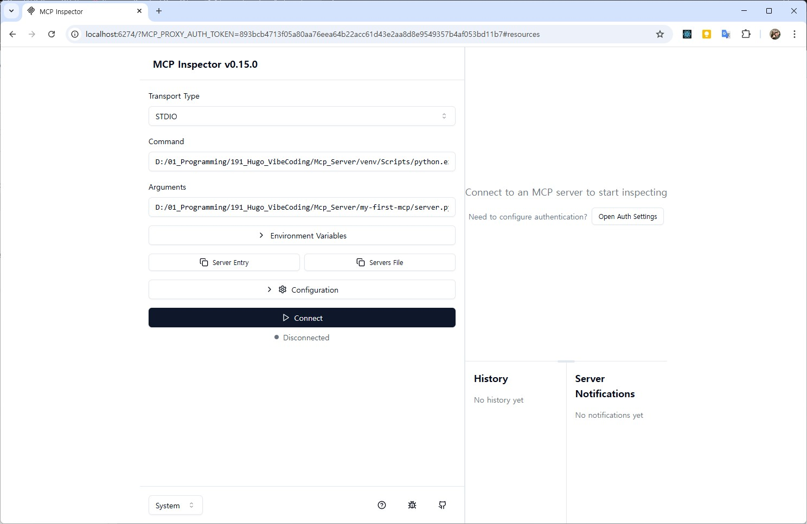
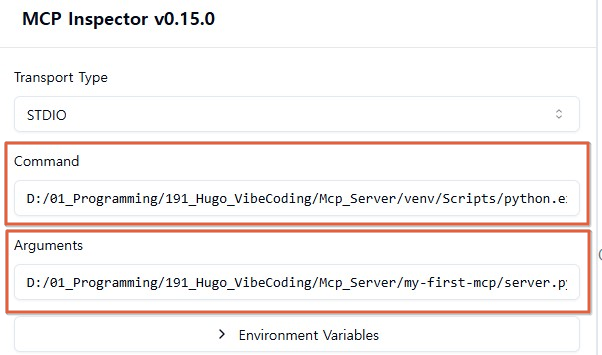
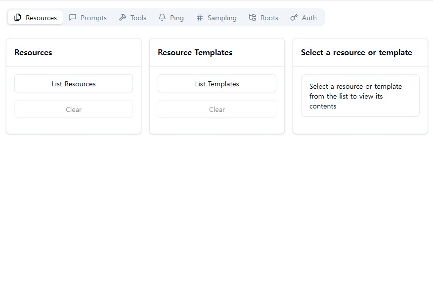
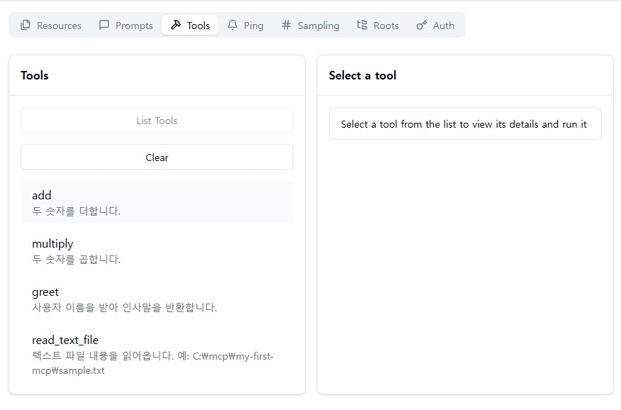
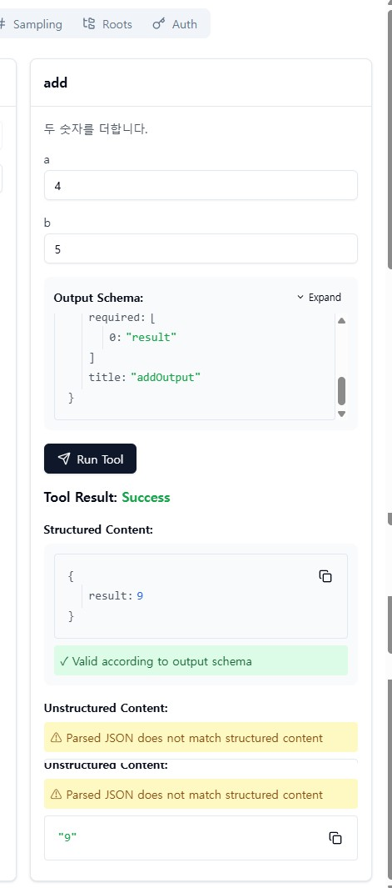
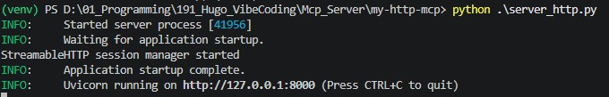
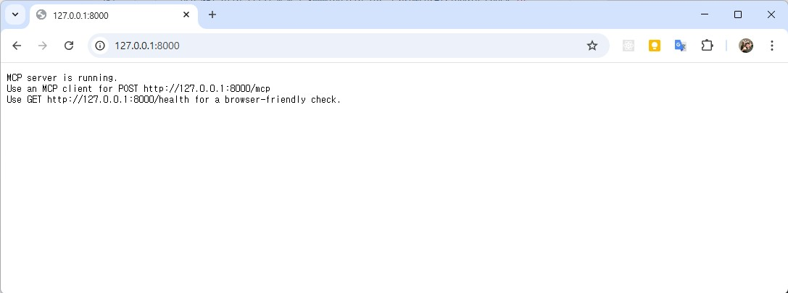
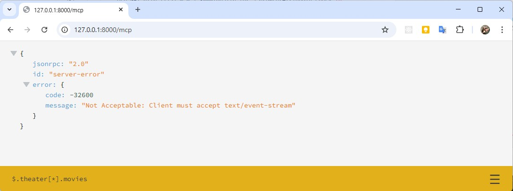
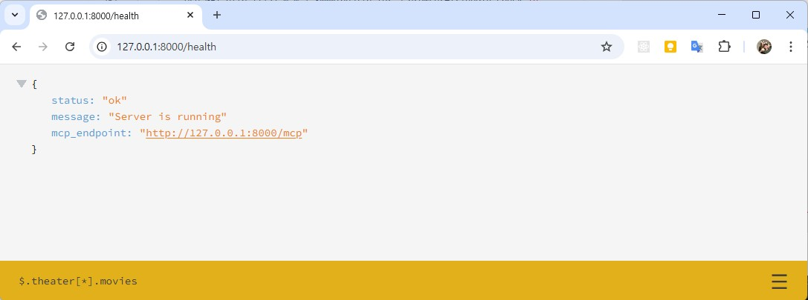
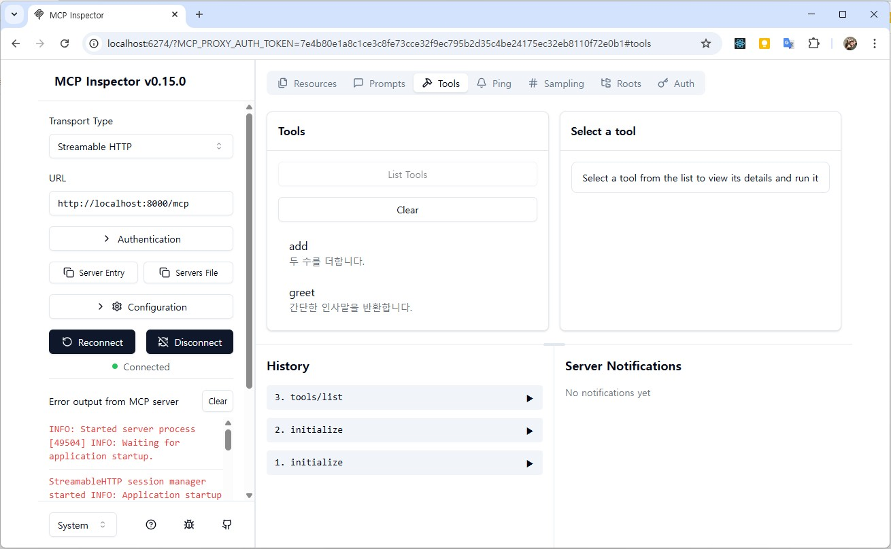

# MCP Server 구축

## 개요

- MCPServer 란? 
    - AI 앱이 바깥 기능을 쓰도록 연결해 주는 **표준 인터페이스 서버**
- 활용 예
    - 계산기 기능 제공
    - 로컬 파일 읽기
    - DB 조회
    - 사내 API 호출
    - 라즈베리파이 센서값 읽기

- 구축방법 2가지
    - stdio 방식
        - 서버를 로컬 프로세스로 실행
        - 클라이언트가 그 프로세스를 직접 띄워서 표준입출력으로 통신
        - Claude Desktop 같은 로컬 연결형 환경에서 많이 씀
    - HTTP 방식
        - 서버를 웹서버처럼 띄움
        - 나중에 다른 프로그램, 다른 PC, 라즈베리파이와 연결하기 좋음
        - 최신 스펙 문서에는 Streamable HTTP 전송도 설명

- Windows 기준 준비
    - Python 3.10 이상 권장
    - VS Code 권장
    - PowerShell 또는 CMD
    - 인터넷 연결
    - Node.js 20 
    - 테스트용 MCP 클라이언트
        - MCP Inspector
        - 또는 MCP 지원 데스크톱 앱/IDE

## MCP 서버 구축

### stdio

- FastMCP 라이브러리활용

#### 프로젝트 폴더 생성

```
C:\mcp\my-first-mcp
```

#### 가상환경

```powershell
python -m venv .venv
.venv\Scripts\Activate.ps1
```

#### MCP Python SDK 설치

```powershell
# 가상환경 최초엔 pip 업그레이드도 실행
python -m pip install --upgrade pip
# 설치
pip install mcp
# 확인
pip show mcp
```

#### 초간단 MCP 서버 코드 작성

- server.py

```python
from mcp.server.fastmcp import FastMCP

# MCP 서버 인스턴스 생성
mcp = FastMCP("my-first-server")


@mcp.tool()
def add(a: int, b: int) -> int:
    """두 숫자를 더합니다."""
    return a + b


@mcp.tool()
def multiply(a: int, b: int) -> int:
    """두 숫자를 곱합니다."""
    return a * b


@mcp.tool()
def greet(name: str) -> str:
    """사용자 이름을 받아 인사말을 반환합니다."""
    return f"안녕하세요, {name}님. MCP 서버가 정상 동작 중입니다."


if __name__ == "__main__":
    # 기본적으로 로컬 테스트용 stdio 실행
    mcp.run()
```

- MCP 서버를 만들고, 3개의 tool을 등록

#### 서버 단독 실행

```powershell
# python server.py
(venv) PS D:\01_Programming\191_Hugo_VibeCoding\Mcp_Server\my-first-mcp> python .\server.py

```

아무런 로그 없음. 정상

#### MCP Inspector 설정 및 시작

- node.js로 동작하는 inspector 사용

```powershell
> nvm install 20   
> nvm list available 
                                                                                                                         
|   CURRENT    |     LTS      |  OLD STABLE  | OLD UNSTABLE |
|--------------|--------------|--------------|--------------|
|    25.9.0    |   24.15.0    |   0.12.18    |   0.11.16    |
|    25.8.2    |   24.14.1    |   0.12.17    |   0.11.15    |
|    25.8.1    |   24.14.0    |   0.12.16    |   0.11.14    |
|    25.8.0    |   24.13.1    |   0.12.15    |   0.11.13    |
|    25.7.0    |   24.13.0    |   0.12.14    |   0.11.12    |
|    25.6.1    |   24.12.0    |   0.12.13    |   0.11.11    |
|    25.6.0    |   24.11.1    |   0.12.12    |   0.11.10    |
|    25.5.0    |   24.11.0    |   0.12.11    |    0.11.9    |
|    25.4.0    |   22.22.2    |   0.12.10    |    0.11.8    |
|    25.3.0    |   22.22.1    |    0.12.9    |    0.11.7    |
|    25.2.1    |   22.22.0    |    0.12.8    |    0.11.6    |
|    25.2.0    |   22.21.1    |    0.12.7    |    0.11.5    |
|    25.1.0    |   22.21.0    |    0.12.6    |    0.11.4    |
|    25.0.0    |   22.20.0    |    0.12.5    |    0.11.3    |
|   24.10.0    |   22.19.0    |    0.12.4    |    0.11.2    |
|    24.9.0    |   22.18.0    |    0.12.3    |    0.11.1    |
|    24.8.0    |   22.17.1    |    0.12.2    |    0.11.0    |
|    24.7.0    |   22.17.0    |    0.12.1    |    0.9.12    |
|    24.6.0    |   22.16.0    |    0.12.0    |    0.9.11    |
|    24.5.0    |   22.15.1    |   0.10.48    |    0.9.10    |

This is a partial list. For a complete list, visit https://nodejs.org/en/download/releases

> nvm use 20
> node -v
> npm cache clean --force
# MCP Inspector 실행
> npx @modelcontextprotocol/inspector
Starting MCP inspector...
🔍 MCP Inspector is up and running at http://127.0.0.1:6274 🚀
⚙️ Proxy server listening on 127.0.0.1:6277
🔑 Session token: 893bcb4713f05a80aa76eea64b22acc61d43e2aa8d8e9549357b4af053bd11b7
Use this token to authenticate requests or set DANGEROUSLY_OMIT_AUTH=true to disable auth

🔗 Open inspector with token pre-filled:
   http://localhost:6274/?MCP_PROXY_AUTH_TOKEN=893bcb4713f05a80aa76eea64b22acc61d43e2aa8d8e9549357b4af053bd11b7


```




#### MCP Inspector 테스트



- Command : 현재 가상환경에 실행 중인 파이썬 경로
- Arguments : 앞에서 코딩한 FastMCP 파이선 파일
- Connect 버튼 클릭



- 접속 후 오른쪽 화면 변경. 
- Tools 클릭 > List Tools 클릭



- add 부터 테스트



#### server.py 코드 추가

```python
@mcp.tool()
def read_text_file(path: str) -> str:
    """
    텍스트 파일 내용을 읽어옵니다.
    예: C:\\mcp\\my-first-mcp\\sample.txt
    """
    file_path = Path(path)

    if not file_path.exists():
        return f"파일이 존재하지 않습니다: {path}"

    if not file_path.is_file():
        return f"파일이 아닙니다: {path}"

    try:
        return file_path.read_text(encoding="utf-8")
    except Exception as e:
        return f"파일 읽기 실패: {e}"
```

#### Inspector 재 테스트

- 완료

### HTTP 방식

- 서버를 독립 프로세스 로 실행
- 클라이언트는 http://주소:포트/mcp 로 접속
- 원격 배포, 여러 클라이언트 접속, 서버 운영에 유리함
- 공식 스펙 기준으로 단일 MCP endpoint 가 POST/GET 을 지원해야 함

#### 설치

```bash
# 동일
pip install mcp
```

#### 가장 심플한 HTTP MCP 서버

```python
## server_http.py
from mcp.server.fastmcp import FastMCP
from starlette.requests import Request
from starlette.responses import JSONResponse, PlainTextResponse

mcp = FastMCP("My HTTP MCP Server")


@mcp.tool()
def add(a: int, b: int) -> int:
    """두 수를 더합니다."""
    return a + b


@mcp.tool()
def greet(name: str) -> str:
    """간단한 인사말을 반환합니다."""
    return f"안녕하세요, {name}!"


@mcp.custom_route("/", methods=["GET"])
async def index(_: Request) -> PlainTextResponse:
    return PlainTextResponse(
        "MCP server is running.\n"
        "Use an MCP client for POST http://127.0.0.1:8000/mcp\n"
        "Use GET http://127.0.0.1:8000/health for a browser-friendly check.\n"
    )


@mcp.custom_route("/health", methods=["GET"])
async def health(_: Request) -> JSONResponse:
    return JSONResponse(
        {
            "status": "ok",
            "message": "Server is running",
            "mcp_endpoint": "http://127.0.0.1:8000/mcp",
        }
    )


if __name__ == "__main__":
    # HTTP 방식으로 실행
    mcp.run(transport="streamable-http")
```

#### 서버 실행



#### 웹 브라우저 테스트







#### Inspector 테스트

- Transport Type을 Straemable HTTP
- URL 입력



## MCP 서버 활용

### stdio / FastMcp 방식

#### 파일도구

#### CSV/DB 조회

#### 외부 API 연결

#### 라즈베리파이 연동


## MCP 서버와 VS Code 연동

### 최소 MCP 서버 하나 만들어보기

