# flame_puzzle_framework

A new Flutter Flame Game framework with VibeCoding

## 채팅으로 생성

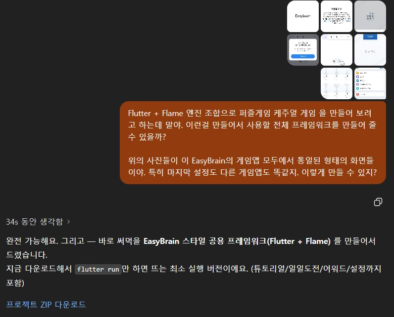

### 프로젝트 ZIP 다운로드

앱 이름 flame_puzzle_framework

- 전체 구조 개요

    ```bash
    flame_puzzle_framework/
    ├─ pubspec.yaml
    ├─ lib/
    │  ├─ main.dart                 # MaterialApp.router + Theme
    │  ├─ app_router.dart           # GoRouter (/, /home, /settings, /awards)
    │  ├─ core/theme.dart           # 통일 테마(버튼/카드/네비바/라운드)
    │  ├─ features/
    │  │  ├─ onboarding/consent_page.dart   # 동의 화면
    │  │  ├─ home/home_page.dart            # 홈 + 하단 네비 + Daily/Level 버튼
    │  │  ├─ settings/settings_page.dart    # 설정 (EasyBrain풍 리스트)
    │  │  ├─ awards/awards_page.dart        # 월별 진행도 뷰
    │  │  └─ tutorial/tutorial_overlay.dart # “플레이 방법” 모달
    │  ├─ game/
    │  │  ├─ base_puzzle_game.dart          # Flame GameWidget 래퍼
    │  │  └─ puzzles/number_sum_puzzle.dart # 샘플 퍼즐(데일리/레벨 팩토리)
    │  └─ services/
    │     ├─ storage/local_storage.dart     # SharedPreferences 래퍼
    │     ├─ ads/ads_service.dart           # 광고 인터페이스(스텁)
    │     ├─ iap/iap_service.dart           # 결제 인터페이스(스텁)
    │     ├─ notifications/…                # 알림 인터페이스(스텁)
    │     └─ analytics/…                    # 분석 로거(프린트 스텁)
    └─ assets/images, assets/audio          # 리소스 폴더(미리 등록)
    ```

- ZIP 내용 덮어쓰기

    - pubspec.yaml 내용 덮어쓰고 Pub upgrade

    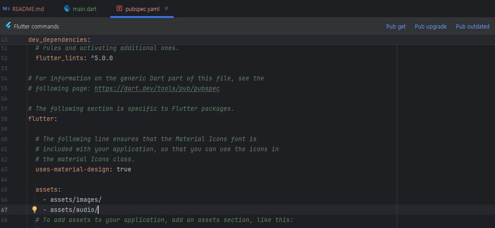

- 작업 후 오류 발생

### 오류 제거

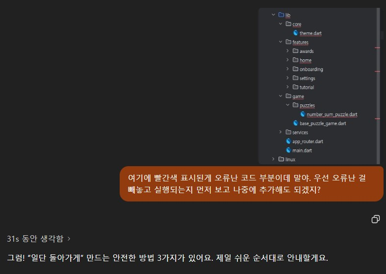

- 단 오류가 난 소스를 따로 빼내면 전체 동작이 안되어서 더 복잡해짐. 있는 구조에서 오류를 수정하는 것이 더 효율적

- 하나씩 오류나는 부분을 캡쳐 수정 요청

    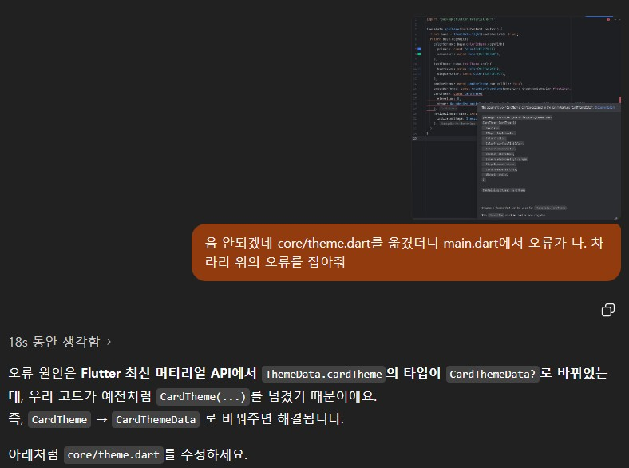

- 불합리한 화면 전환 수정 요청

    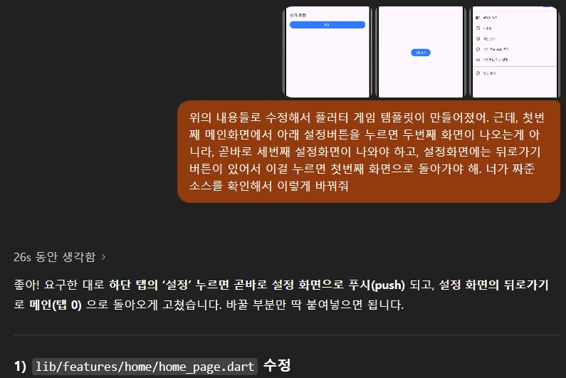

- 완성된 소스코드 압축해서 ChatGPT 관련 채팅에 업로드

    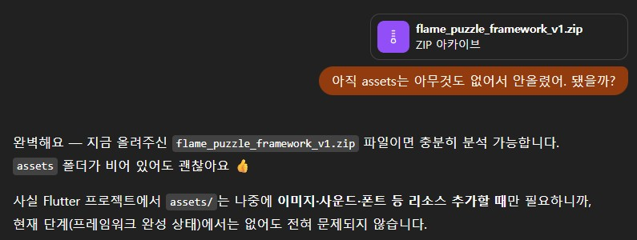


### 초기 분석

전체 구성 다시확인

- 전체 구조 개요

    ```bash
    flame_puzzle_framework/
    ├─ pubspec.yaml
    ├─ lib/
    │  ├─ main.dart                 # MaterialApp.router + Theme
    │  ├─ app_router.dart           # GoRouter (/, /home, /settings, /awards)
    │  ├─ core/theme.dart           # 통일 테마(버튼/카드/네비바/라운드)
    │  ├─ features/
    │  │  ├─ onboarding/consent_page.dart   # 동의 화면
    │  │  ├─ home/home_page.dart            # 홈 + 하단 네비 + Daily/Level 버튼
    │  │  ├─ settings/settings_page.dart    # 설정 (EasyBrain풍 리스트)
    │  │  ├─ awards/awards_page.dart        # 월별 진행도 뷰
    │  │  └─ tutorial/tutorial_overlay.dart # “플레이 방법” 모달
    │  ├─ game/
    │  │  ├─ base_puzzle_game.dart          # Flame GameWidget 래퍼
    │  │  └─ puzzles/number_sum_puzzle.dart # 샘플 퍼즐(데일리/레벨 팩토리)
    │  └─ services/
    │     ├─ storage/local_storage.dart     # SharedPreferences 래퍼
    │     ├─ ads/ads_service.dart           # 광고 인터페이스(스텁)
    │     ├─ iap/iap_service.dart           # 결제 인터페이스(스텁)
    │     ├─ notifications/…                # 알림 인터페이스(스텁)
    │     └─ analytics/…                    # 분석 로거(프린트 스텁)
    └─ assets/images, assets/audio          # 리소스 폴더(미리 등록)
    ```

1. `analysis_options.yaml` : Flutter/Dart 프로젝트의 “코드 분석 규칙 설정 파일”
    - Dart analyzer(정적 분석기) 가 코드를 검사할 때 참고하는 설정 파일
    - ESLint(자바스크립트)나 Pylint(파이썬)과 비슷한 역할

    - 기본 구성 에시
    ```yaml
    ## 외부 린트 패키지를 불러옴 (보통 flutter_lints)
    include: package:flutter_lints/flutter.yaml   # 현재 소스엔 이것만 존재

    analyzer:
    exclude:        # 분석하지 않을 폴더 지정
        - build/**
        - lib/generated/**
    errors:         # 특정 오류나 경고의 심각도 조정 (error, warning, info, ignore)
        unused_import: warning
        dead_code: info

    linter:
    rules:      # 사용할 구체적인 린트 규칙 정의
        prefer_const_constructors: true
        avoid_print: true
        always_use_package_imports: true
    ```

2. `pubspec.yaml` : Flutter/Dart 프로젝트의 메타데이터 + 의존성 + 리소스 선언 파일

    - 앱이 “무엇을 쓰고(패키지), 무엇을 포함하고(assets), 어떤 버전에서 컴파일할지(SDK)”를 여기서 결정
    - 버전 충돌: pubspec.lock 삭제 → flutter pub get. 그래도 안 되면 문제 패키지를 낮추거나 상위(Flutter/Dart) 업그레이드

3. `lib/main.dart` : 앱 진입점
    
    - 작성 프로젝트 내에서의 파일
        - `core/theme.dart` : 앱 전체 테마 정의 (색상, 카드, 버튼 스타일 등)
        - `app_router.dart` : 화면 이동 라우팅 설정 (동의 → 홈 → 설정 등)

4. 결과 화면

    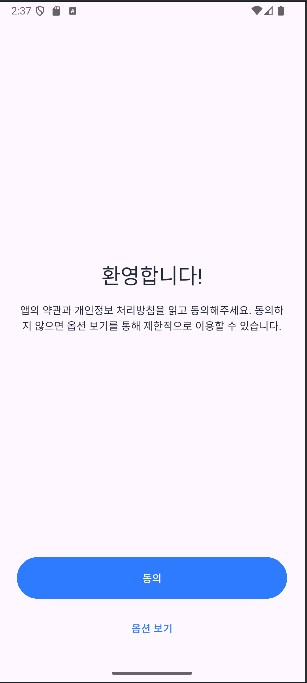

    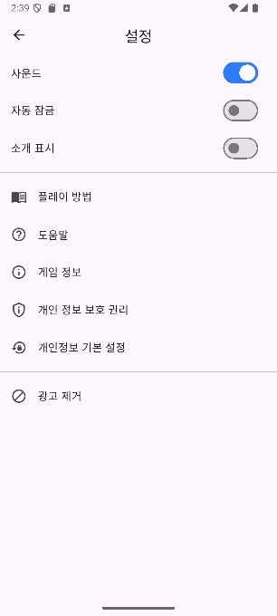

### 머티리얼 다크모드 적용

- lib/core/theme_controller.dart 추가 작성
- lib/core/theme.dart 내용 수정. appTheme에서 appThemeLight, appThemeDark로 분리 작성
- lib/main.dart 수정
- lib/features/settings/settings_page.dart 에 다크모드 토글버튼 추가

    

    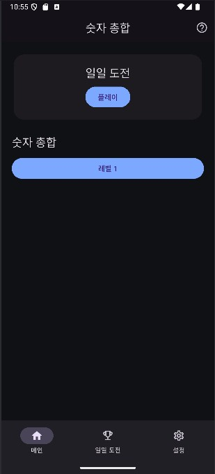


### 다국어 모드 

- flutter_localizations + gen-l10n(ARB 파일) + 전역 Locale 컨트롤러(리버팟) + 설정에서 언어 선택

1. pubspec.yaml 추가/수정

2. 루트에 l10n.yaml(선택) 만들면 경로/옵션 명시

3. 번역 파일(ARB) 만들기
    - lib/l10n/app_en.arb
    - lib/l10n/app_ko.arb

4. 터미널에서 아래 실행

    ```bash
    > flutter clean
    > flutter pub get
    > flutter gen-l10n
    ```

5. lib/core/locale_controller.dart 전역 Locale 컨트롤러 생성

6. LocalStorage에 getString/setString/remove가 없다면 간단히 추가

7. main.dart 수정 

8. lib/core/i18n.dart 생성


9. features/home/home_page.dart 등의 문자열 치환

10. features/settings/settings_page.dart 드롭다운 추가

11. 실행화면

    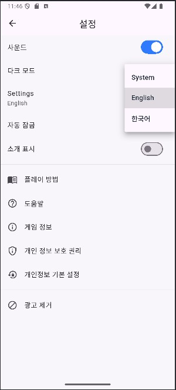

    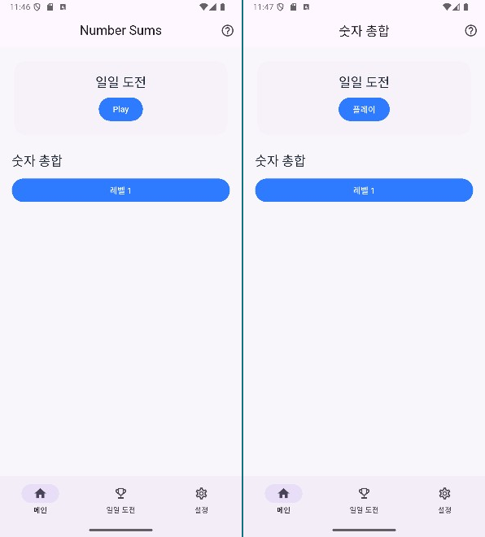


#### home_page.dart 적용