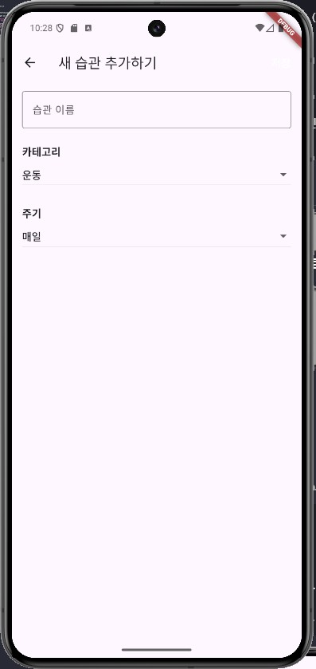

# habit_tracker_app

습관 트래커 + AI 코치 앱

## Getting Started

This project is a starting point for a Flutter application.

A few resources to get you started if this is your first Flutter project:

- [Lab: Write your first Flutter app](https://docs.flutter.dev/get-started/codelab)
- [Cookbook: Useful Flutter samples](https://docs.flutter.dev/cookbook)

For help getting started with Flutter development, view the
[online documentation](https://docs.flutter.dev/), which offers tutorials,
samples, guidance on mobile development, and a full API reference.

## 생성 PRD 마크다운

```markdown
# 📱 PRD: 습관 트래커 + AI 코치 앱


## 1. 🎯 프로젝트 비전
- 단순히 체크하는 습관 앱이 아니라, **사용자의 행동 패턴을 분석**하고 **AI 코치가 맞춤형 피드백**을 제공하는 앱
- 목표: “습관을 지키는 재미” + “개인화된 동기부여”

---

## 2. 👤 주요 사용자 페르소나
- **자기계발러**: 매일 루틴을 지키고 싶지만 작심삼일이 되는 사람
- **헬스/공부러**: 운동, 공부, 독서 습관을 꾸준히 관리하고 싶은 사람
- **데이터 러버**: 자신의 패턴을 시각화해서 보고 싶은 사람

---

## 3. 🛠 핵심 기능

### (1) 습관 관리
- 습관 생성: 이름, 카테고리(운동/공부/생활), 주기(매일/주 3회 등)
- 체크인: 완료 시 원터치 기록
- 진행률: 주간/월간 달성률 시각화

### (2) AI 코치
- **패턴 분석**: 사용자의 체크 기록 → “아침에 강한 타입”, “주말에 약한 타입” 등 인사이트 제공
- **맞춤 피드백**:
- 성공 시 → “이번 주는 아침 루틴이 완벽했어요! 👏”
- 실패 시 → “주말에 자주 놓치네요. 알람을 설정해볼까요?”
- **챌린지 제안**: “이번 주는 3일 연속 달성에 도전해보세요!”

### (3) 알림 & 동기부여
- 푸시 알림: 습관 시간에 맞춰 리마인드
- 긍정 메시지: AI가 짧은 코멘트 제공

### (4) 데이터 시각화
- 달력 뷰: 성공/실패 표시
- 그래프: 주간/월간 달성률, 시간대별 성공률

---

## 4. 🎨 UX/UI 톤앤매너
- **심플 + 긍정적**
- 체크 성공 시 애니메이션(예: 불꽃, 별 터짐)
- AI 코치 캐릭터: 친근한 챗봇 느낌 (텍스트 기반, 이모지 활용)

---

## 5. 📊 성공 지표 (KPI)
- DAU (Daily Active Users)
- 습관 유지율 (30일 이상 유지한 습관 비율)
- AI 피드백 반응률 (좋아요/공감 버튼 클릭률)

---

## 6. 🏗 기술 스택 (예시)
- **Frontend**: Flutter (iOS/Android 동시 개발)
- **Backend**: Firebase (Auth, Firestore, Push)
- **AI 분석**: Python 기반 API (패턴 분석, 피드백 생성)

---

## 7. 🚀 MVP 범위
- 습관 생성/체크/달력 뷰
- 기본 AI 피드백 (성공/실패 코멘트)
- 푸시 알림   
```

## Gemini 채팅
- 위의 PRD 붙여넣고 작업 시작

### 0. 바이브코딩 스타일 개발 튜토리얼 생성

### 1. 프로젝트 셋팅
1. Flutter 프로젝트 생성
2. Firebase 프로젝트 생성 및 연동

### 2. 핵심기능 구현
1. UI 화면 만들기
    - main.dart 수정
    - screens/main_screen.dart 생성
    - screens/add_habit_screen.dart 생성

```
habit_tracker_app/
└── lib/
    ├── screens/
    |   ├── main_screen.dart
    |   └── add_habit_screen.dart
    |
    └── main.dart
```


2. 확인 : + 버튼을 눌러 새 습관 추가하기



### 3. 데이터 연결하기
1. Firebase Firestore
    - pubspec.yaml 파일의 dependencies: 아래 추가

        ```yaml
        dependencies:
            flutter:
                sdk: flutter
            # --- 여기에 추가 ---
            firebase_core: ^2.15.1
            cloud_firestore: ^4.9.1
            # ------------------
            cupertino_icons: ^1.0.2
        ```

2. 라이브러리 최신버전은 https://pub.dev/ 에서 확인
3. Flutter 실행 종료 후, 터미널에서

    ```shell
    > flutter pub add firebase_core
    > flutter pub add cloud_firestore
    ## 또는...
    > flutter pub get    ## 설치
    ```

    

