# habit_tracker_app

습관 트래커 + AI 코치 앱

## 생성 PRD 마크다운

```markdown
# 📱 PRD: 습관 트래커 + AI 코치 앱


## 1. 🎯 프로젝트 비전
- 단순히 체크하는 습관 앱이 아니라, **사용자의 행동 패턴을 분석**하고 **AI 코치가 맞춤형 피드백**을 제공하는 앱
- 목표: “습관을 지키는 재미” + “개인화된 동기부여”

---

## 2. 👤 주요 사용자 페르소나
- **자기계발러**: 매일 루틴을 지키고 싶지만 작심삼일이 되는 사람
- **헬스/공부러**: 운동, 공부, 독서 습관을 꾸준히 관리하고 싶은 사람
- **데이터 러버**: 자신의 패턴을 시각화해서 보고 싶은 사람

---

## 3. 🛠 핵심 기능

### (1) 습관 관리
- 습관 생성: 이름, 카테고리(운동/공부/생활), 주기(매일/주 3회 등)
- 체크인: 완료 시 원터치 기록
- 진행률: 주간/월간 달성률 시각화

### (2) AI 코치
- **패턴 분석**: 사용자의 체크 기록 → “아침에 강한 타입”, “주말에 약한 타입” 등 인사이트 제공
- **맞춤 피드백**:
- 성공 시 → “이번 주는 아침 루틴이 완벽했어요! 👏”
- 실패 시 → “주말에 자주 놓치네요. 알람을 설정해볼까요?”
- **챌린지 제안**: “이번 주는 3일 연속 달성에 도전해보세요!”

### (3) 알림 & 동기부여
- 푸시 알림: 습관 시간에 맞춰 리마인드
- 긍정 메시지: AI가 짧은 코멘트 제공

### (4) 데이터 시각화
- 달력 뷰: 성공/실패 표시
- 그래프: 주간/월간 달성률, 시간대별 성공률

---

## 4. 🎨 UX/UI 톤앤매너
- **심플 + 긍정적**
- 체크 성공 시 애니메이션(예: 불꽃, 별 터짐)
- AI 코치 캐릭터: 친근한 챗봇 느낌 (텍스트 기반, 이모지 활용)

---

## 5. 📊 성공 지표 (KPI)
- DAU (Daily Active Users)
- 습관 유지율 (30일 이상 유지한 습관 비율)
- AI 피드백 반응률 (좋아요/공감 버튼 클릭률)

---

## 6. 🏗 기술 스택 (예시)
- **Frontend**: Flutter (iOS/Android 동시 개발)
- **Backend**: Firebase (Auth, Firestore, Push)
- **AI 분석**: Python 기반 API (패턴 분석, 피드백 생성)

---

## 7. 🚀 MVP 범위
- 습관 생성/체크/달력 뷰
- 기본 AI 피드백 (성공/실패 코멘트)
- 푸시 알림   
```

## Gemini 채팅
- 위의 PRD 붙여넣고 작업 시작
- 대략적인 대화 내용들

    ```
    - 위의 PRD파일로 바이브코딩을 시작해줘
    - 튜토리얼 형태로 순서를 만들어줘
    - 오류가 난 부분을 수정해줘
    - ...
    - habits 컬렉션을 만들고 나니까 들어가는 건 확인했는데.

        from Lcom/google/android/gms/org/conscrypt/Platform; (domain=app) using reflection: allowed

        I/flutter (20662): 데이터 저장 성공! Document ID: s5NvDecXCjuhJ8hYMiB6

        I/flutter (20662): 데이터 저장 실패: Null check operator used on a null value

        이렇게 뜨는 마지막 로그의 이유는 뭐야?
    ```

### 0. 바이브코딩 스타일 개발 튜토리얼 생성

### 1. 프로젝트 셋팅
1. Flutter 프로젝트 생성
2. Firebase 프로젝트 생성 및 연동

### 2. 핵심기능 구현
1. UI 화면 만들기
    - main.dart 수정
    - screens/main_screen.dart 생성
    - screens/add_habit_screen.dart 생성

```
habit_tracker_app/
└── lib/
    ├── screens/
    |   ├── main_screen.dart
    |   └── add_habit_screen.dart
    |
    └── main.dart
```

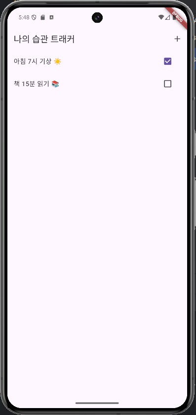

2. 확인 : + 버튼을 눌러 새 습관 추가하기

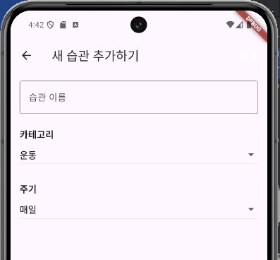

### 3. 데이터 연결하기
1. Firebase Firestore
    - pubspec.yaml 파일의 dependencies: 아래 추가

        ```yaml
        dependencies:
            flutter:
                sdk: flutter
            # --- 여기에 추가 ---
            firebase_core: ^2.15.1
            cloud_firestore: ^4.9.1
            # ------------------
            cupertino_icons: ^1.0.2
        ```

2. 라이브러리 최신버전은 https://pub.dev/ 에서 확인
3. Flutter 실행 종료 후, 터미널에서

    ```shell
    > flutter pub add firebase_core
    > flutter pub add cloud_firestore
    ## 또는...
    > flutter pub get    ## 설치
    ```

    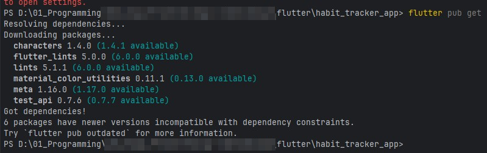

4. flutterfire_cli 설치

    - npm으로 firebase tool 설치

    ```powershell
    > npm install -g firebase-tools
    ```

    - Firebase 로그인 : 웹 브라우저 연동

    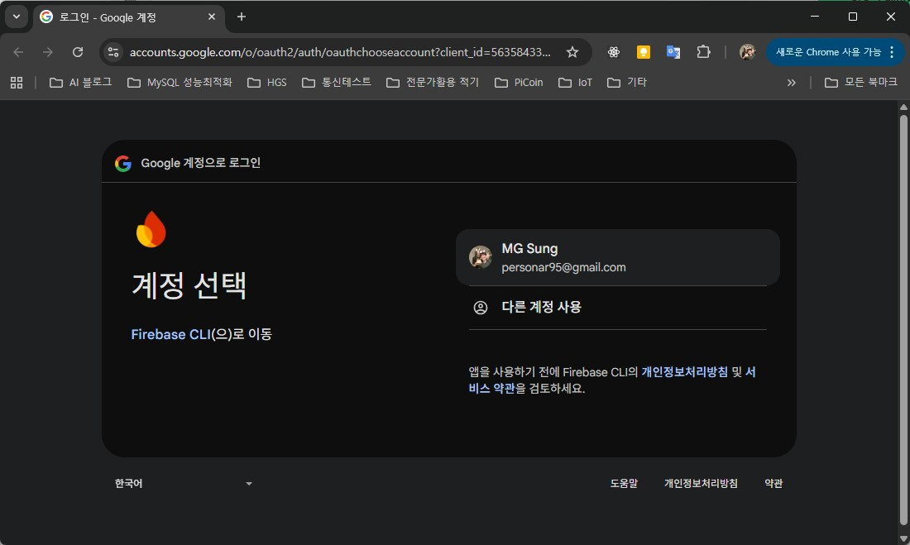

    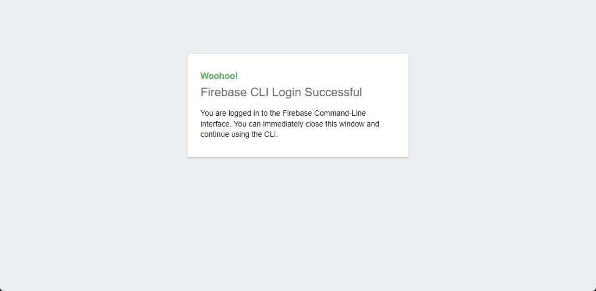

    ```powershell
    > dart pub global activate flutterfire_cli
    ...
    Installed executable flutterfire.
    Warning: Pub installs executables into C:\Users\HugoSung\AppData\Local\Pub\Cache\bin, which is not on your path.
    You can fix that by adding that directory to your system's "Path" environment variable.
    A web search for "configure windows path" will show you how.
    ```

    - 시스템 경로 등록

    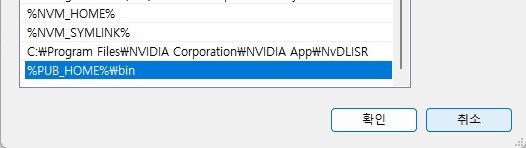

5. firebase_options.dart 자동생성

    ```powershell
    > flutterfire configure
    ```

    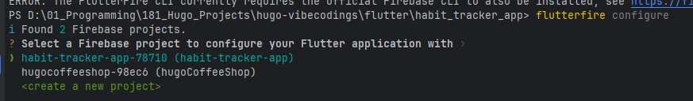

    - 키보드로 해당 프로젝트 선택 후 엔터

    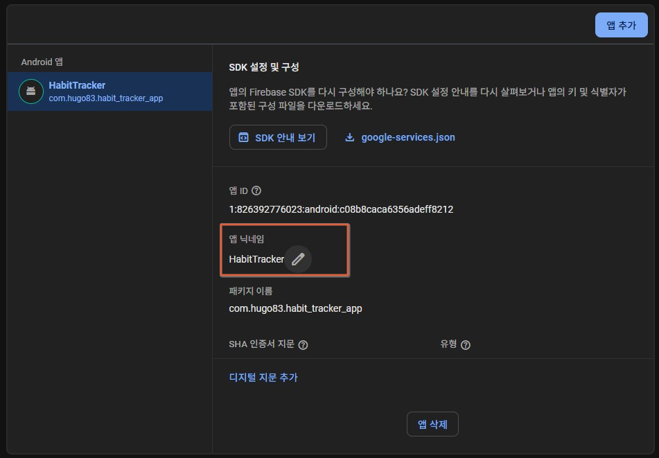

    - Firebase의 앱 이름은 한글로 하면 안됨

    

    완료 후 firebase_options.dart 확인

4. 앱 시작시 Firebase 초기화
    - main.dart 위쪽 수정

    ```dart
    // 1. Firebase Core 라이브러리 가져오기
    import 'package:firebase_core/firebase_core.dart';
    import 'firebase_options.dart'; // FlutterFire CLI가 만들어준 설정 파일

    // 2. main 함수를 async 방식으로 변경!
    void main() async {
    // 3. Flutter 앱이 실행되기 전에 Firebase가 준비되도록 보장
    WidgetsFlutterBinding.ensureInitialized();
    await Firebase.initializeApp(
        options: DefaultFirebaseOptions.currentPlatform,
    );
    runApp(const MyApp());
    }
    ```

5. Firebase 데이터베이스 추가

    - 빌드 > Firestore Database 선택
    - 컬렉션 habits 추가

6. 데이터 쓰기 (습관 저장 기능 구현)

    - add_habit_screen.dart 저장버튼 구현

    ```dart
    // 2. 저장 버튼! 아직 기능은 없지만 모양만 만들어 둬요.
    TextButton(
        onPressed: () {
            // 2. Firestore 인스턴스에 접근
            // 'habits'라는 이름의 컬렉션(데이터 서랍장)을 가리켜요.
            // 만약 없으면 자동으로 만들어줘요!
            FirebaseFirestore.instance.collection('habits').add({
            'name': _habitNameController.text, // 사용자가 입력한 습관 이름
            'category': _selectedCategory,     // 사용자가 선택한 카테고리
            'cycle': _selectedCycle,         // 사용자가 선택한 주기
            'createdAt': Timestamp.now(),    // 습관을 만든 시간 (정렬할 때 유용해요)
            });

            // 저장이 끝나면 이전 화면으로 돌아가기
            Navigator.pop(context);
        },
        child: Text(
            '저장',
            style: TextStyle(color: Colors.white, fontSize: 16),
        ),
    ),
    ```

    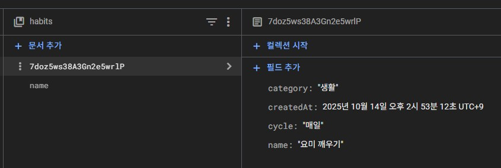

7. 데이터 읽기 (실시간으로 목록 보여주기) 

    - main_screen.dart / body에 실시간 표시로 수정

    ```dart
    body: StreamBuilder<QuerySnapshot>(
        // 2. 어떤 데이터를 실시간으로 들을지 지정
        // 'habits' 컬렉션의 데이터를 'createdAt' 시간 순서대로 들을 거야!
        stream: FirebaseFirestore.instance.collection('habits').orderBy('createdAt').snapshots(),
        
        // 3. 데이터가 바뀔 때마다 이 builder 부분이 새로 실행돼요
        builder: (context, snapshot) {
            // 4. 데이터 로딩 중일 때
            if (snapshot.connectionState == ConnectionState.waiting) {
            return Center(child: CircularProgressIndicator()); // 로딩 동그라미 보여주기
            }

            // 5. 데이터가 없을 때
            if (!snapshot.hasData || snapshot.data!.docs.isEmpty) {
            return Center(child: Text("아직 등록된 습관이 없어요.\n새 습관을 추가해보세요! 💪"));
            }

            // 6. 데이터가 성공적으로 왔을 때!
            final habitDocs = snapshot.data!.docs; // 습관 목록 가져오기

            // ListView를 사용해서 목록을 그려줘요.
            return ListView.builder(
            itemCount: habitDocs.length, // 목록 개수
            itemBuilder: (context, index) {
                // habitDocs[index]에서 각 습관의 데이터를 꺼내요.
                final habit = habitDocs[index];
                final habitName = habit['name']; // 'name' 필드의 값을 가져옴

                return ListTile(
                title: Text(habitName),
                trailing: Checkbox(
                    value: false, // TODO: 체크인 기능 구현하기
                    onChanged: (bool? value) {
                    // TODO: 체크 상태 변경 코드
                    },
                ),
                );
            },
            );
        },
    ),
    ```

    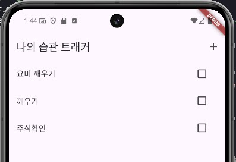

8. 체크박스 완료/미완료 기능 추가

    - add_habit_screen.dart 데이터를 저장하는 부분에 isCompleted 필드를 추가

    ```dart
    final docRef = await FirebaseFirestore.instance.collection('habits').add({
            'name': _habitNameController.text,
            'category': _selectedCategory,
            'cycle': _selectedCycle,
            'createdAt': Timestamp.now(),
            'isCompleted': false, // 👈 이 필드를 추가해주세요! (초기값은 false)
        });
    ```

    - main_screen.dart / ListView.builder 부분 수정

    ```dart
    return ListView.builder(
    itemCount: habitDocs.length, // 목록 개수
        itemBuilder: (context, index) {
            // habitDocs[index]에서 각 습관의 데이터를 꺼내요.
            final habit = habitDocs[index];
            final String docId = habit.id; // 🔥 업데이트에 꼭 필요한 문서의 고유 ID
            final habitName = habit['name']; // 'name' 필드의 값을 가져옴
            // 'isCompleted' 필드를 가져오되, 없으면(null) 기본값으로 false를 사용해요.
            final bool isCompleted = habit['isCompleted'] ?? false;

            return ListTile(
            title: Text(
                habitName,
                style: TextStyle(
                // 완료된 항목은 취소선 표시
                decoration: isCompleted ? TextDecoration.lineThrough : null,
                ),
            ),
            trailing: Checkbox(
                // ✅ 1. 체크박스의 값은 Firestore 문서의 'isCompleted' 값!
                value: isCompleted,
                // ✅ 2. 사용자가 체크박스를 누르면 상태를 Firestore에 업데이트!
                onChanged: (bool? newValue) {
                if (newValue != null) {
                    FirebaseFirestore.instance
                        .collection('habits')
                        .doc(docId) // 이 ID를 가진 문서를 찾아서
                        .update({'isCompleted': newValue}); // isCompleted 필드를 새 값으로 변경!
                }
                },
            ),
            );
        },
    );
    ```

    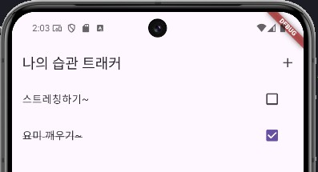

    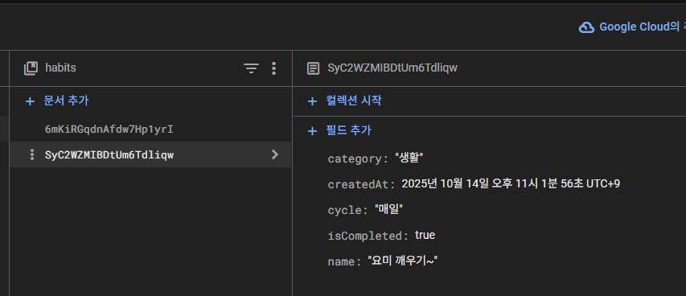


9. 1차 완료

### 4. 달력 뷰 만들기 (시각화)

- 채팅 내용

    ```
    다음 단계: 달력 뷰 만들기 (시각화) 시작해줘
    ```

#### table_calendar 라이브러리 설치

- 터미널에서 실행

    ```powershell
    > flutter pub add table_calendar
    ```

- 설치 후 pubspec.yaml 파일에서 dependencies: 항목 확인

    ```yaml
    dependencies:
    flutter:
        sdk: flutter

    # --- firebase 라이브러리추가
    firebase_core: ^4.1.1
    cloud_firestore: ^6.0.2
        # ------------------
    # The following adds the Cupertino Icons font to your application.
    # Use with the CupertinoIcons class for iOS style icons.
    cupertino_icons: ^1.0.8
    table_calendar: ^3.2.0
    ```

- calendar_screen.dart 파일 생성


#### 홈 화면에서 달력 화면으로 이동

- 기존의 홈 화면(습관 목록이 있는 화면)에 달력 아이콘 버튼 등을 만들어서 CalendarScreen으로 이동할 수 있도록 연결

- main_screen.dart 에 + 버튼 앞에 달력 버튼 추가

    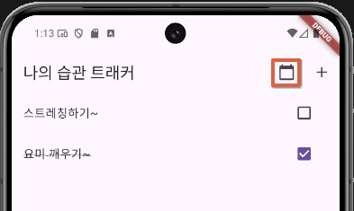

    달력 클릭

    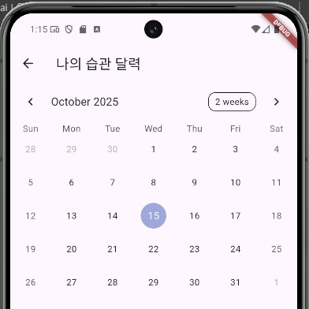


#### calendar_screen.dart 에 FireStore 연결 준비

- calendar_screen.dart의 _CalendarScreenState 클래스 안에 아래 변수를 추가

    ```dart
    // 🔥 1. 완료된 습관들을 날짜별로 저장할 Map 변수 추가!
    // 예: { 2023-10-27: ['운동하기', '책읽기'], 2023-10-28: ['물마시기'] }
    Map<DateTime, List<String>> _completedHabits = {};
    ```

- Firestore에서 데이터 불러오는 함수 만들기

    ```dart
    @override
    void initState() {
        super.initState();
        _loadCompletedHabits(); // 화면이 시작될 때 데이터를 불러옵니다.
    }

    // 생략 ...
    ```

- 달력과 데이터 연결하기 : build 메소드 안의 TableCalendar 부분을 아래와 같이 수정

    ```dart
    // ...
    body: TableCalendar(
    // ... firstDay, lastDay, focusedDay 등은 그대로 ...

    // 🔥 3. 이 부분을 추가해주세요!
    // eventLoader는 특정 날짜에 어떤 이벤트가 있는지 알려주는 역할
    eventLoader: (day) {
        // 시/분/초를 제거한 깨끗한 날짜로 만들어줘야 정확한 비교가 가능해요.
        final normalizedDay = DateTime.utc(day.year, day.month, day.day);
        return _completedHabits[normalizedDay] ?? []; // 해당 날짜에 완료된 습관 목록을 반환
    },

    // ... onDaySelected 등 나머지 부분은 그대로 ...
    ),
    // ...
    ```

    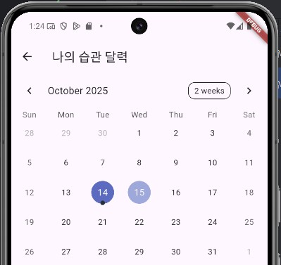

- 완료 표시 날짜 클릭시 완료 습관 리스트 보이기

    - calendar_screen.dart의 _CalendarScreenState 클래스에 _selectedDayHabits  변수 추가
    - TableCalendar 위젯의 onDaySelected 속성을 수정
    - Scaffold의 body 부분을 Column으로 감싸고, 달력 아래에 ListView를 추가

    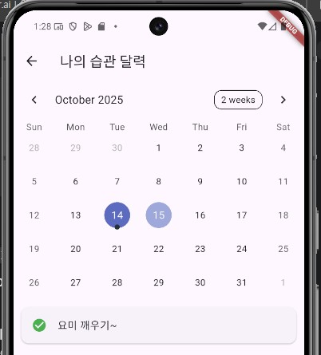

- 완료 아이콘 변경

    - TableCalendar 위젯에 calendarBuilders: CalendarBuilders 추가

    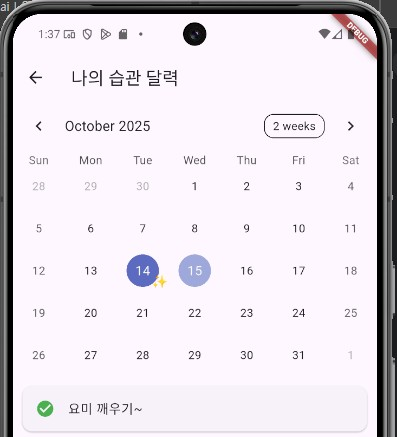


### 5. AI 코치 추가

#### AI 대신 간단한 규칙기반 피드백 

