# 바이브코딩 with CODEX

---

# AI에게 제대로 시키자!

## 🎯 목표

- 바이브코딩 개념 이해
- 좋은 프롬프트 작성 능력 습득
- AI와 협업하는 기본 감각 형성

- 코딩을 배우러 왔습니다. 근데, 코딩을 안합니다. 코딩은 AI가 하죠.

---

## 1. 바이브코딩 개념

### 핵심 개념

- 코딩 = 직접 작성 → ❌
- 코딩 = AI와 협업 → ✅

#### 기존 개발 방식

- 요구사항 분석
- 설계
- 코드 작성
- 디버깅
- 테스트
- 배포

이걸 누가 했습니까?

#### 바이브코딩 방식

- 요구사항 정의 → 사람이
- 코드 생성 → AI
- 검증/수정 → 사람

#### 그러니까 예전엔...

- 내가 물 끓이고, 면 넣고, 스프 넣고, 고명 넣고...
- AI가 다 끓여주면, 맛있는지 판단

### 핵심 포인트

- AI는 "주니어 개발자"
- 사람은 "PM + 리뷰어"

### 바이브코딩 개발환경 설정

여러가지 방식이 존재. 본인에게 맞는 방식 찾으면 됨

#### VS Code 확장

- Codex – OpenAI’s coding agent 검색 후 설치
- Copilot은 기본! Codex는 옵션...

#### Codex CLI 방식

- [링크](../openai/codex/README.md)

---

## 2. 프롬프트 설계

- 프롬프트 = “명령”이 아니라 “설계도”

- 지시가 이상하면 결과도 이상합니다

### 나쁜 예

```
로그인 만들어줘
```

### ✅ 좋은 예

#### 개선 1단계

```
로그인 기능을 만들어줘. Python으로.
```

#### 개선 2단계

```
너는 백엔드 개발자야.

사용자 로그인 기능을 만들어줘.
Python FastAPI 사용
```

#### 개선 3단계

```
너는 백엔드 개발자야.

사용자 로그인 API를 만들어줘.
- Python FastAPI 사용
- JWT 인증
- 에러 처리 포함
```

- 위 프롬프트로 진행한 결과


### 프롬프트 패턴 5가지

#### 역할 부여 패턴

```
You are a senior developer.
```

- 코드 품질 상승
- 구조 개선

#### 단계 분해 패턴

```
이 기능을 단계별로 나눠줘
```

- 복잡한 문제 분해 정복

#### 예시 제공 패턴

```
이 코드 스타일처럼 만들어줘:
[코드]
```

- 일관성 유지
- 코딩 규칙

#### 제약조건 패턴

```
- Python 사용
- 함수형 스타일
- 테스트 포함
```

- 개발방향 고정

#### 개선요청 패턴

```
이 코드를 더 좋은 구조로 개선해줘
```

- 리팩토링 자동화

#### 정리

- AI에게 자유를 주면 망하고, 제약을 주면 흥한다!

### 🎯 실습

- 같은 요청을 3가지 방식으로 작성
- 결과 비교

```
뭔가 멋진 로그인 만들어줘 (?)
```

---

## 3. 코드 생성 & 개선

### 왜 “코드 생성”부터 배우는가

- 이전까지는
  - 코드는 사람이 다 짜야함
  - AI가 짜준 코드는 못믿겠음
  - 내가 모르는데 써도 되나?

- 이제는
  - AI에게 맡기고 나온 결과를 판단하라!

### 코드생성 프롬프트 재강조

#### 이러지 마세요

```
TODO 리스트 만들어줘
```

#### 이렇게 하세요

```
HTML, CSS, JavaScript로 간단한 TODO 리스트를 만들어줘.
기능은 다음과 같아:
- 할 일 추가
- 할 일 완료 체크
- 할 일 삭제
- 새로고침 전까지 브라우저에서 동작
- 초보자가 이해하기 쉽게 작성
- 하나의 HTML 파일로 만들어줘
```

### 실습 1: 간단 기능 만들기

- TODO 리스트

#### 하지 말라는 것 부터 먼저해봅니다

- `이러지 마세요` 소스코드 복사해서 실행해봅니다.

#### 이렇게 하세요를 실행합니다.

- `이렇게 하세요` 소스코드를 복사해서 전달합니다.
- VS Code에 결과 코드를 복사합니다.
- 확장에서 Live Server를 설치합니다

  

### 실습 2: 간단 API 만들기

- 간단 API

#### 약한 요청

```
할 일 API 만들어줘
```

#### 개선된 요청

```
You are a senior backend developer.

Python FastAPI로 간단한 TODO API를 만들어줘.

요구사항:
- 할 일 목록 조회
- 할 일 추가
- 할 일 완료 상태 변경
- 할 일 삭제
- 데이터는 메모리 리스트에 저장
- 초보자가 이해하기 쉽게 작성
- 실행 방법도 같이 설명
```

#### 실행결과

실행 방법

1. 가상환경 설치 및 실행

```
python -m venv venv
./venv/scripts/activate.ps1
```

2. FastAPI와 Uvicorn 설치

터미널에서 아래 명령어를 실행합니다.

`pip install fastapi uvicorn` 3. 파일 저장

위 코드를 main.py 이름으로 저장합니다.

4. 서버 실행
   `uvicorn main:app --reload`

`원하면 바로 다음 단계로 FastAPI + HTML 한 파일 프론트엔드 연결 버전까지 이어서 만들어드릴게요.` 요청

5. main.py와 index.html 수정

6. 실행결과

   

### 실습 3: 리팩토링 요청

- http://127.0.0.1:8000/docs 실행

```
이 코드를 더 깔끔하게 리팩토링해줘.

조건:
- 기능은 그대로 유지
- 함수로 분리
- 변수명 더 명확하게
- 초보자도 이해 가능하게
- 변경 이유 설명
```

#### 예시 1: 데이터 구조 개선

```
현재 TODO API 코드에서 Todo 항목을 Pydantic 모델로 정리해줘.
필드:
- id
- title
- completed
```

#### 예시 2: 예외 처리 추가

```
존재하지 않는 id로 수정 또는 삭제할 때 적절한 에러를 반환하도록 개선해줘.
FastAPI의 HTTPException을 사용해줘.
```

#### 예시 3: 코드 설명 요청

```
이 코드를 초보자에게 설명하듯이 줄 단위가 아니라 블록 단위로 설명해줘.
- import 부분
- 데이터 저장 부분
- 엔드포인트 부분
- 실행 흐름
```

테스트 해볼 것

---

## 4. Codex + VS Code 연동

### 왜 VS Code 연동의 중요성

브라우저에서 ChatGPT만 쓰면 이런 식이 된다.

- 코드 복붙
- 다시 붙여넣기
- 파일 바꿀 때마다 컨텍스트 손실
- 프로젝트 전체 맥락 전달이 어려움

반면 Codex를 IDE에서 쓰면, VS Code 안에서 로컬 변경사항을 보면서 코드를 편집할 수 있고, 프로젝트 구조를 기준으로 작업을 이어갈 수 있음.

### 로그인 방식

두 가지 방식 지원

- ChatGPT 로그인 : 구독기반 접근
- API 키로 로그인 : 사용량 기반 접근

Codex Cloud는 ChatGPT 로그인이 필요. CLI와 IDE 확장은 두 방식 모두 지원

### 설치 실습

1. Step 1. VS Code 실행
2. Step 2. Codex 확장 설치
3. Step 3. Codex 패널 열기
4. Step 4. ChatGPT로 로그인

구독 플랜이 포함된 계정이면 ChatGPT 로그인 방식으로 바로 쓸 수 있다. ChatGPT Plus, Pro, Business, Edu, Enterprise 플랜에는 Codex가 포함된다고 OpenAI 문서가 안내한다.

### 프로젝트 실습

- 프로젝트 생성
- 파일 단위 생성
- 코드 수정 요청

### 정리

- AI는 편집자이지, 최종 책임자는 아니다
- 프로젝트 문맥을 주면 훨씬 좋아진다
- 한 번에 너무 크게 시키지 않는다

---

## 5. 미니 프로젝트 시작

### 🎯 주제 선택

- 퍼즐 게임
- 유튜브 기록 앱

### PRD 설계하기

- PRD란? Product Requirements Document. 제품 요구사항 정의서. “AI에게 줄 설계도”

#### 퍼즐 게임 PRD 예시

```
## 프로젝트: 간단한 퍼즐 게임

### 목표:
- 브라우저에서 실행되는 퍼즐 게임

### 기능:
- 퍼즐 보드 표시
- 클릭 이벤트 처리
- 클리어 조건 판단

### 기술:
- HTML, CSS, JavaScript
- 하나의 index.html 파일

### 대상:
- 코딩 초보자
```

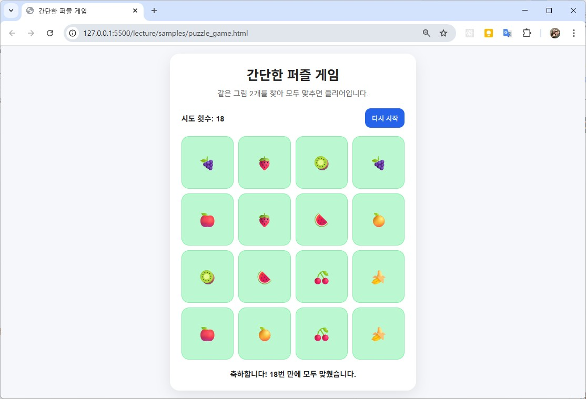

#### 유튜브 기록 앱 PRD 예시

```
## 프로젝트: 유튜브 학습 기록 앱

### 목표:
- 본 유튜브 영상을 기록하고 다시 보기

### 기능:
- URL 입력
- 목록 저장
- 클릭 시 열기
- 삭제 기능

### 기술:
- HTML, CSS, JavaScript
- localStorage 사용

### 대상:
- 코딩 초보자
```

- PRD가 구체적일수록 결과가 좋음

## 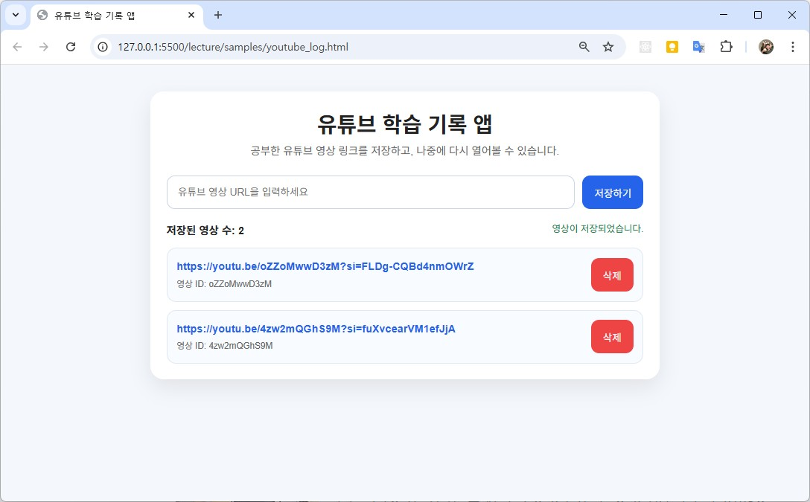

# AI와 함께 개발하기

## 🎯 목표

- 실제 프로젝트 완성
- 디버깅 능력 확보
- 배포 경험

---

## 6. 프로젝트 설계

### 목표

- 프로젝트를 바로 코딩하지 않고 먼저 구조로 나누기
- 기능을 폴더와 파일 단위로 생각하기
- AI에게 “폴더 구조 설계”를 요청하기
- 왜 구조가 중요한지 이해하기
- 작은 프로젝트에서 큰 프로젝트로 확장되는 감각 얻기

### 프로젝트에 설계가 필요한 이유

#### 퍼즐게임 개발순서

- 화면 만들기
- 카드 넣기
- 클릭 이벤트 만들기

#### 설계를 안 하면 생기는 문제

1. 한 파일이 너무 길어진다
   - index.html 안에 HTML/CSS/JS 다 들어감
   - 처음엔 쉽지만 나중에 지옥
2. 수정할 곳을 찾기 어렵다
   - UI를 바꾸려면 어디로?
   - 점수 로직은 어디로?
   - 이벤트는 어디로?
3. 다른 사람과 협업하기 어렵다
   - 내가 봐도 헷갈리는데 남은 더 헷갈림
4. 기능 추가가 무섭다
   - 타이머 하나 넣으려다 전체가 깨짐

#### 나쁜 구조의 예

```
samples/
└─ puzzle_game.html
```

#### 조금 나은 구조

```
puzzle-game/
├─ index.html
├─ css/
│  └─ style.css
└─ js/
   └─ app.js
```

#### 소형 프로젝트 구조

```
puzzle-game/
├─ index.html
├─ css/
│  ├─ style.css
│  └─ board.css
├─ js/
│  ├─ app.js
│  ├─ board.js
│  ├─ game.js
│  └─ utils.js
└─ assets/
   └─ images/
```

- 구조는 처음부터 너무 거창할 필요는 없지만,
  커질 가능성을 생각해서 나눠두면 훨씬 편함

#### AI에게 폴더 구조 설계 맡기기

- 기본프롬프트

```
웹 기반 퍼즐 게임의 폴더 구조를 설계해줘
```

- 개선된 프롬프트

```
You are a senior frontend developer.

웹 기반 퍼즐 게임의 폴더 구조를 설계해줘.

조건:
- HTML, CSS, JavaScript 사용
- 초보자가 이해하기 쉬운 구조
- 너무 복잡하지 않게
- 카드 뒤집기 퍼즐 게임 기준
- 각 파일의 역할도 함께 설명해줘
```

#### 구조분석

```
puzzle-game/
├─ index.html       -- 기본화면 뼈대
├─ css/
│  └─ board.css     -- 카드, 보드배치, 버튼 디자인
├─ js/
│  ├─ app.js        -- 앱 시작점
│  ├─ board.js      -- 퍼즐보드 그리기
│  ├─ game.js       -- 클릭처리, 정답확인, 클리어조건
│  └─ utils.js      -- 랜덤 섞기, 공통합수
└─ assets/
   └─ images/       -- 카드 이미지
```

### 실습

```
유튜브 학습 기록 앱 구조 분석해보세요
```

---

## 7. 기능 구현 (3시간)

### 목표

한 번에 만들지 말고, 단계별로 쪼개서 구현한다

- 기능을 작은 단계로 나눠 구현하기
- AI에게 “전체 완성”이 아니라 “부분 구현”을 요청하기
- UI, 게임 로직, 점수 시스템을 순서대로 붙이기
- 실행 → 확인 → 수정 → 확장 흐름 익히기

### 단계별 구현의 장점

#### 1. 에러가 나도 어디서 깨졌는지 알기 쉽다

- UI는 출력됨
- 클릭은 안 됨
  - JS 이벤트 쪽 문제로 좁혀진다
- AI도 범위가 좁을 수록 결과가 좋아짐

#### 2. 성취감을 빨리 느낀다

- 보드가 먼저 뜨고
- 클릭 기능 확인
- 게임 동작 확인

### 구현 계획 먼저 세우기

#### 간단 프롬프트

```
단계별로 구현 계획을 세워줘
```

#### 개선형 프롬프트

```
You are a senior frontend developer.

웹 기반 퍼즐 게임을 만들려고 해.
기능은 다음과 같아:
- 게임 로직
- UI 구성
- 점수 시스템

초보자가 따라할 수 있도록
단계별 구현 계획을 세워줘.

각 단계마다
- 무엇을 만드는지
- 왜 이 순서인지
- 완료 기준이 무엇인지
함께 설명해줘.
```

### 1단계 구현

#### AI 요청 프롬프트

```
브라우저에서 실행되는 간단한 퍼즐 게임의 기본 UI를 만들어줘.

조건:
- HTML, CSS, JavaScript 사용
- 먼저 게임 화면 뼈대만 만들 것
- 제목, 설명, 게임판 영역, 시도 횟수 표시, 다시 시작 버튼 포함
- 초보자가 이해하기 쉽게 작성
- CSS는 너무 화려하지 않고 깔끔하게
```

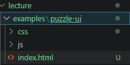

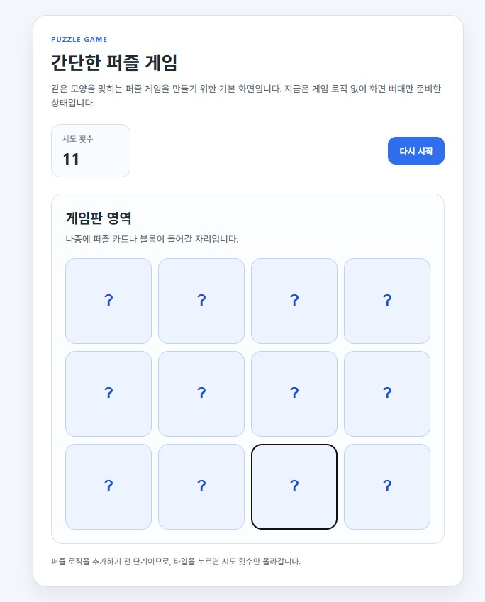

### 2단계 구현 — 게임 로직

#### 보드데이터 요청 프롬프트

```
현재 퍼즐 게임 UI가 있어.

이제 게임 보드 데이터를 만들어줘.

조건:
- 같은 그림이 2개씩 있는 카드 배열
- 카드 배열을 랜덤으로 섞기
- 나중에 화면에 출력하기 쉽게 구조를 잡아줘
- 초보자가 이해할 수 있게 주석 포함
```

#### 화면에 카드 뿌리기 프롬프트

```
현재 퍼즐 카드 배열이 있어.

이 배열을 기준으로 게임판에 카드를 출력하는 코드를 추가해줘.

조건:
- 카드가 그리드 형태로 보이게
- 처음에는 카드 내용이 보이지 않게
- 클릭 가능한 상태로 만들 것
```

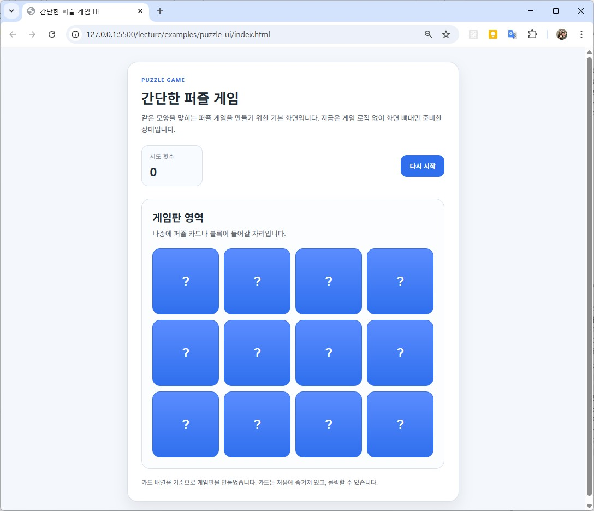

#### 클릭 이벤트 처리 프롬프트

```
각 카드를 클릭하면 내용이 보이도록 구현해줘.

조건:
- 한 번 클릭하면 카드가 뒤집힘
- 이미 뒤집힌 카드는 다시 처리하지 않음
- 너무 복잡한 문법은 쓰지 말 것
```

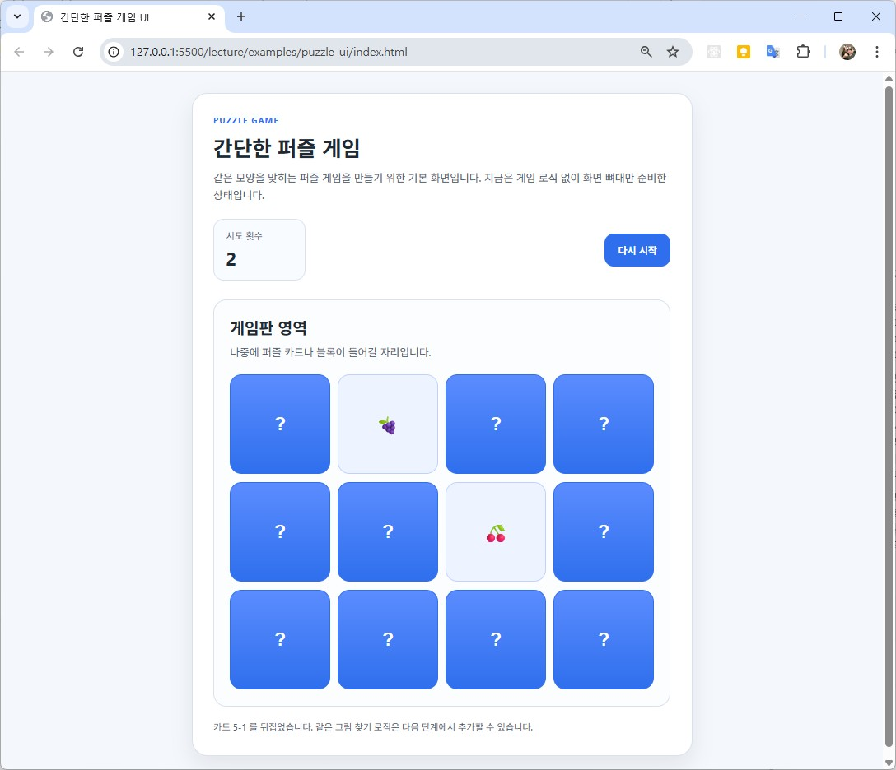

#### 두 장 비교하기 프롬프트

```
이제 카드 2장을 선택했을 때 같은 카드인지 비교하는 로직을 추가해줘.

조건:
- 두 장이 같으면 열린 상태 유지
- 다르면 잠깐 보여준 뒤 다시 닫기
- 이미 맞춘 카드는 다시 선택되지 않게
- 초보자 기준으로 이해 가능한 코드
```

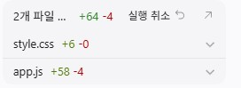

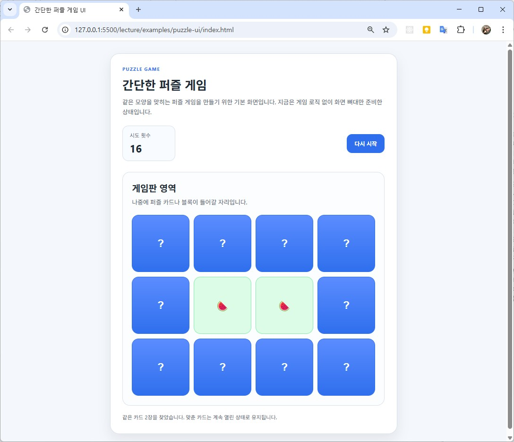

### 3단계 구현 - 점수 시스템

#### 시도 횟수 추가 프롬프트

```
현재 퍼즐 게임에 시도 횟수 기능을 추가해줘.

조건:
- 카드 2장을 비교할 때마다 시도 횟수 1 증가
- 화면에 숫자가 보이게
- 다시 시작하면 0으로 초기화
```

- 이미 되어있죠?

#### 맞춘 카드 수 / 클리어 판단 프롬프트

```
현재 퍼즐 게임에 클리어 조건을 추가해줘.

조건:
- 모든 카드를 맞추면 클리어 메시지 표시
- 몇 번 만에 클리어했는지도 함께 보여주기
```

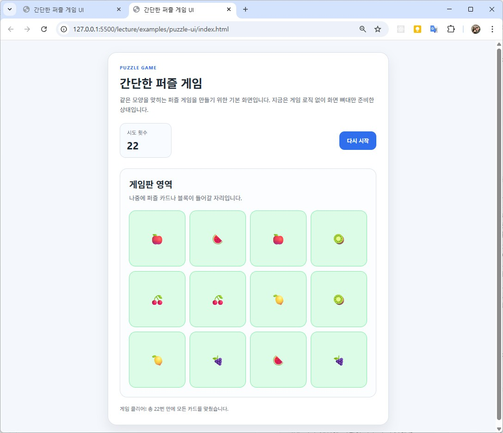

---

#### 다시 시작 버튼 연결 프롬프트

```
다시 시작 버튼을 누르면 게임이 초기화되게 해줘.

조건:
- 카드 배열 다시 섞기
- 시도 횟수 초기화
- 클리어 메시지 초기화
- 게임판 새로 그리기
```

- 이미 구현되어 있음

#### 점수 기능 추가

알아서 해보세요~

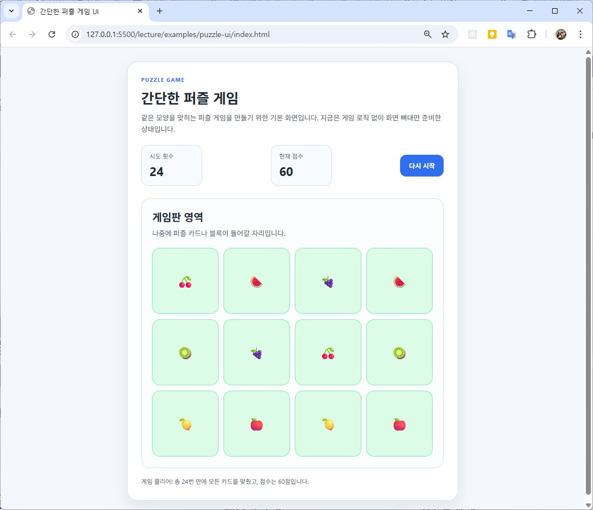

### 통합 점검

#### 점검 체크리스트

- UI
    - 제목 보이는가
    - 버튼 보이는가
    - 점수 영역 보이는가
- 게임 로직
    - 카드가 출력되는가
    - 클릭하면 뒤집히는가
    - 두 장 비교가 되는가
    - 맞으면 유지되는가
    - 틀리면 다시 닫히는가
- 점수 시스템
    - 시도 횟수 올라가는가
    - 클리어 메시지가 뜨는가
    - 다시 시작이 초기화되는가

### 자주 하는 실수

```
퍼즐 게임 완성해줘
```

## 8. 디버깅

### 목표

- 에러를 무서워하지 않고 읽기
- 에러 메시지를 일부가 아니라 전체 전달하기
- AI에게 에러 해결을 요청하는 방법 익히기
- 수정 후 다시 실행하고 검증하는 흐름 익히기
- “어디서 깨졌는지” 좁혀서 생각하는 습관 만들기

### 기본방법

#### 기본 프롬프트

```
이 에러 로그를 해결해줘.
[에러 전체 복사]
```

#### 개선 프롬프트

```
이 에러 로그를 해결해줘.

에러 로그:
[에러 전체 복사]

현재 상황:
- HTML, CSS, JavaScript로 만든 퍼즐 게임
- 카드 클릭 이벤트 추가 후 발생
- 초보자 기준으로 원인과 해결 방법을 설명해줘
```

### 에러 읽는 기본 법칙

- 이전의 디버깅 방식과 동일
    - 맨 마지막 줄부터 보기
    - 파일명과 줄 번호 보기
    - 키워드 보기
    - 내가 방금 바꾼 부분 의심하기

### 일부러 에러 만들기

#### 변수명 오타내보기

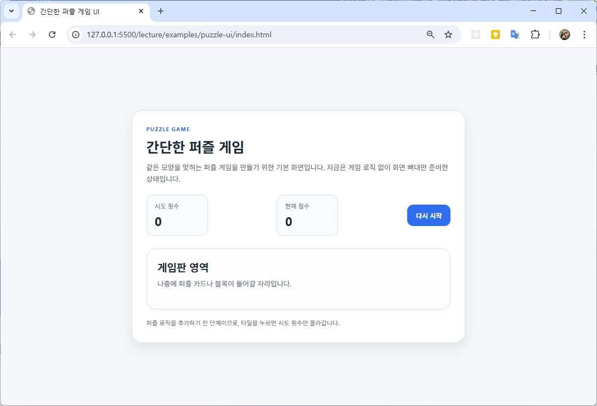


```
현재 소스에서 어디가 오류가 났는지 찾아줘. 
app.js의 가능성이 높아
```

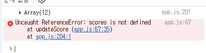

### 🔥 카파시 무브

- AI 연구자 안드레아 카파시의 방법

```
에러가 나면, 추측하지 말고
에러 전체를 AI에게 그대로 던져서
원인과 해결책을 받는 방식
```

---

## 9. 배포 (1시간)
### 목표

- 만든 프로젝트를 인터넷에 올릴 수 있다
- URL로 접속되는 서비스를 갖게 된다
- “로컬 코드 → 실제 서비스” 흐름을 이해한다

### Vercel 사용이유

- 무료, 속도, 자동화

### GitHub에 코드 올리기

Vercel은 GitHub에서 코드를 가져와서 배포

### Vercel 접속
- https://vercel.com/

- 회원가입 및 로그인  (Github 계정 추천)

#### New Project 클릭

- Add New... > Project
- 이름 입력 > build

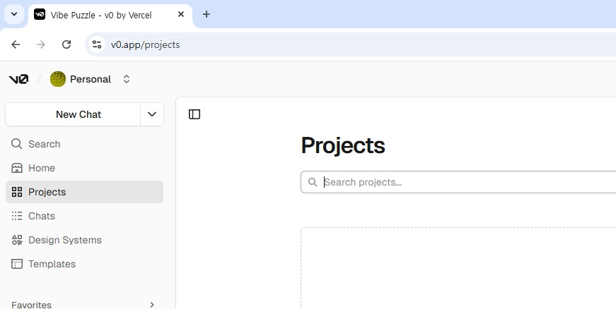

#### Repository 선택

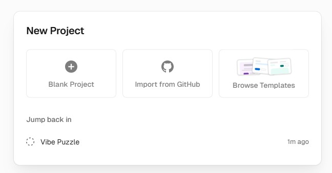

- Github Account 로그인

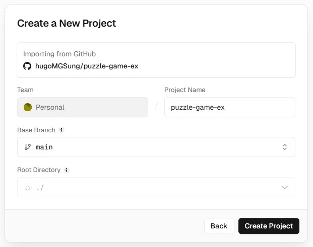

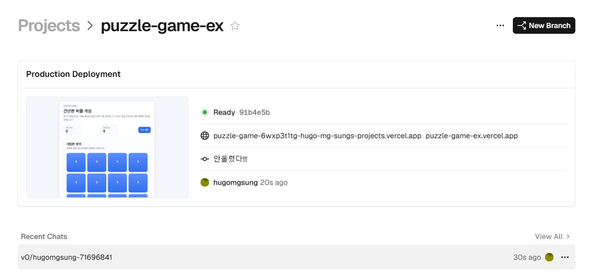

#### Deploy 클릭

- 할 필요도 없음!

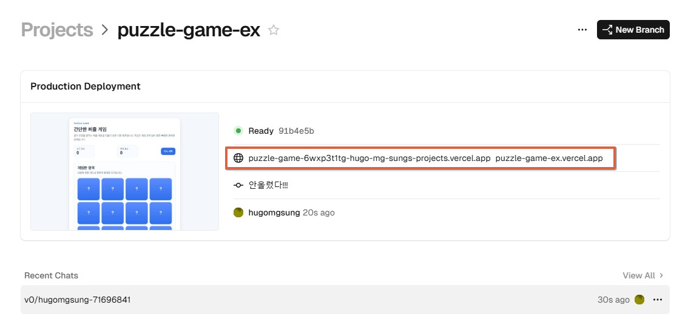

### 실습

- Vercel 배포
- URL 확인
   - [배포링크](https://puzzle-game-6wxp3t1tg-hugo-mg-sungs-projects.vercel.app/)

---

## 10. 개인 프로젝트

### 미션

- 자신만의 서비스 만들기
- PRD 작성
- 배포

---

# 🧩 핵심 프롬프트 세트

## 1. 구조 설계

```
이 프로젝트의 전체 구조를 설계해줘
```

## 2. 단계 분해

```
이 기능을 단계별로 나눠줘
```

## 3. 디버깅

```
이 에러를 해결해줘
```

## 4. 개선

```
더 나은 구조로 개선해줘
```

---

# 🎯 강의 핵심 포인트

- 설명보다 실습
- 완벽보다 반복
- 코딩보다 질문

---

# 😎 한 줄 정리

"AI를 잘 부리는 사람이 개발을 지배한다"
