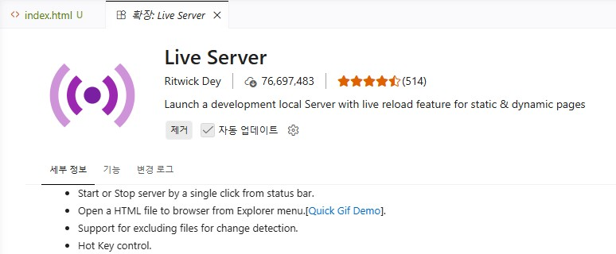
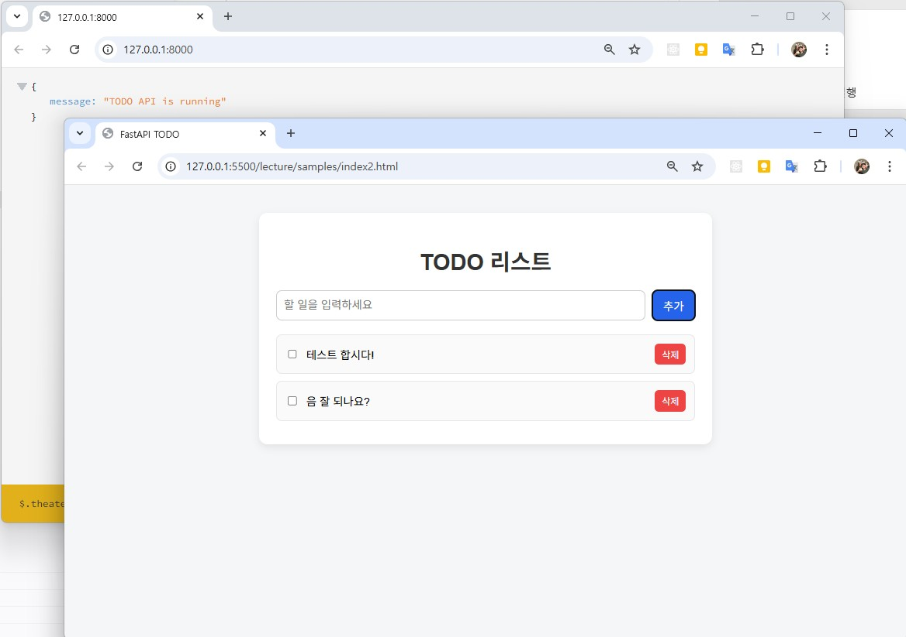

# 바이브코딩 with CODEX

---

# AI에게 제대로 시키자!

## 🎯 목표
- 바이브코딩 개념 이해
- 좋은 프롬프트 작성 능력 습득
- AI와 협업하는 기본 감각 형성

- 코딩을 배우러 왔습니다. 근데, 코딩을 안합니다. 코딩은 AI가 하죠.

---

## 1. 바이브코딩 개념

### 핵심 개념

- 코딩 = 직접 작성 → ❌
- 코딩 = AI와 협업 → ✅

#### 기존 개발 방식

- 요구사항 분석
- 설계
- 코드 작성
- 디버깅
- 테스트
- 배포

이걸 누가 했습니까?

#### 바이브코딩 방식

- 요구사항 정의 → 사람이
- 코드 생성 → AI
- 검증/수정 → 사람

#### 그러니까 예전엔...

- 내가 물 끓이고, 면 넣고, 스프 넣고, 고명 넣고...
- AI가 다 끓여주면, 맛있는지 판단

### 핵심 포인트
- AI는 "주니어 개발자"
- 사람은 "PM + 리뷰어"

### 바이브코딩 개발환경 설정

여러가지 방식이 존재. 본인에게 맞는 방식 찾으면 됨

#### VS Code 확장

- Codex – OpenAI’s coding agent 검색 후 설치
- Copilot은 기본! Codex는 옵션...

#### Codex CLI 방식

- [링크](../openai/codex/README.md)

---

## 2. 프롬프트 설계

- 프롬프트 = “명령”이 아니라 “설계도”

- 지시가 이상하면 결과도 이상합니다

### 나쁜 예
```
로그인 만들어줘
```

### ✅ 좋은 예

#### 개선 1단계

```
로그인 기능을 만들어줘. Python으로.
```

#### 개선 2단계

```
너는 백엔드 개발자야.

사용자 로그인 기능을 만들어줘.
Python FastAPI 사용
```

#### 개선 3단계

```
너는 백엔드 개발자야.

사용자 로그인 API를 만들어줘.
- Python FastAPI 사용
- JWT 인증
- 에러 처리 포함
```

- 위 프롬프트로 진행한 결과


### 프롬프트 패턴 5가지

#### 역할 부여 패턴

```
You are a senior developer.
```

- 코드 품질 상승
- 구조 개선

#### 단계 분해 패턴

```
이 기능을 단계별로 나눠줘
```

- 복잡한 문제 분해 정복

#### 예시 제공 패턴

```
이 코드 스타일처럼 만들어줘:
[코드]
```

- 일관성 유지
- 코딩 규칙

#### 제약조건 패턴

```
- Python 사용
- 함수형 스타일
- 테스트 포함
```

- 개발방향 고정

#### 개선요청 패턴

```
이 코드를 더 좋은 구조로 개선해줘
```

- 리팩토링 자동화

#### 정리

- AI에게 자유를 주면 망하고, 제약을 주면 흥한다!


### 🎯 실습
- 같은 요청을 3가지 방식으로 작성
- 결과 비교

```
뭔가 멋진 로그인 만들어줘 (?)
```

---

## 3. 코드 생성 & 개선

### 왜 “코드 생성”부터 배우는가

- 이전까지는
    - 코드는 사람이 다 짜야함
    - AI가 짜준 코드는 못믿겠음
    - 내가 모르는데 써도 되나?

- 이제는
    - AI에게 맡기고 나온 결과를 판단하라!

### 코드생성 프롬프트 재강조

#### 이러지 마세요

```
TODO 리스트 만들어줘
```

#### 이렇게 하세요

```
HTML, CSS, JavaScript로 간단한 TODO 리스트를 만들어줘.
기능은 다음과 같아:
- 할 일 추가
- 할 일 완료 체크
- 할 일 삭제
- 새로고침 전까지 브라우저에서 동작
- 초보자가 이해하기 쉽게 작성
- 하나의 HTML 파일로 만들어줘
```

### 실습 1: 간단 기능 만들기
- TODO 리스트

#### 하지 말라는 것 부터 먼저해봅니다

- `이러지 마세요` 소스코드 복사해서 실행해봅니다.

#### 이렇게 하세요를 실행합니다.

- `이렇게 하세요` 소스코드를 복사해서 전달합니다.
- VS Code에 결과 코드를 복사합니다.
- 확장에서 Live Server를 설치합니다

    

### 실습 2: 간단 API 만들기
- 간단 API

#### 약한 요청

```
할 일 API 만들어줘
```

#### 개선된 요청

```
You are a senior backend developer.

Python FastAPI로 간단한 TODO API를 만들어줘.

요구사항:
- 할 일 목록 조회
- 할 일 추가
- 할 일 완료 상태 변경
- 할 일 삭제
- 데이터는 메모리 리스트에 저장
- 초보자가 이해하기 쉽게 작성
- 실행 방법도 같이 설명
```

#### 실행결과

실행 방법
1. 가상환경 설치 및 실행

```
python -m venv venv
./venv/scripts/activate.ps1
```
2. FastAPI와 Uvicorn 설치

터미널에서 아래 명령어를 실행합니다.

```pip install fastapi uvicorn```
3. 파일 저장

위 코드를 main.py 이름으로 저장합니다.

4. 서버 실행
```uvicorn main:app --reload```

`원하면 바로 다음 단계로 FastAPI + HTML 한 파일 프론트엔드 연결 버전까지 이어서 만들어드릴게요.` 요청

5. main.py와 index.html 수정

6. 실행결과 

    

### 실습 3: 리팩토링 요청

- http://127.0.0.1:8000/docs 실행

```
이 코드를 더 깔끔하게 리팩토링해줘.

조건:
- 기능은 그대로 유지
- 함수로 분리
- 변수명 더 명확하게
- 초보자도 이해 가능하게
- 변경 이유 설명
```

#### 예시 1: 데이터 구조 개선

```
현재 TODO API 코드에서 Todo 항목을 Pydantic 모델로 정리해줘.
필드:
- id
- title
- completed
```

#### 예시 2: 예외 처리 추가

```
존재하지 않는 id로 수정 또는 삭제할 때 적절한 에러를 반환하도록 개선해줘.
FastAPI의 HTTPException을 사용해줘.
```

#### 예시 3: 코드 설명 요청

```
이 코드를 초보자에게 설명하듯이 줄 단위가 아니라 블록 단위로 설명해줘.
- import 부분
- 데이터 저장 부분
- 엔드포인트 부분
- 실행 흐름
```

테스트 해볼 것

---

## 4. Codex + VS Code 연동

### 왜 VS Code 연동의 중요성

브라우저에서 ChatGPT만 쓰면 이런 식이 된다.

- 코드 복붙
- 다시 붙여넣기
- 파일 바꿀 때마다 컨텍스트 손실
- 프로젝트 전체 맥락 전달이 어려움

반면 Codex를 IDE에서 쓰면, VS Code 안에서 로컬 변경사항을 보면서 코드를 편집할 수 있고, 프로젝트 구조를 기준으로 작업을 이어갈 수 있음.

### 로그인 방식

두 가지 방식 지원
- ChatGPT 로그인 : 구독기반 접근
- API 키로 로그인 : 사용량 기반 접근

Codex Cloud는 ChatGPT 로그인이 필요. CLI와 IDE 확장은 두 방식 모두 지원

### 설치 실습

1. Step 1. VS Code 실행
2. Step 2. Codex 확장 설치
3. Step 3. Codex 패널 열기
4. Step 4. ChatGPT로 로그인

구독 플랜이 포함된 계정이면 ChatGPT 로그인 방식으로 바로 쓸 수 있다. ChatGPT Plus, Pro, Business, Edu, Enterprise 플랜에는 Codex가 포함된다고 OpenAI 문서가 안내한다.

### 프로젝트 실습
- 프로젝트 생성
- 파일 단위 생성
- 코드 수정 요청

### 정리
- AI는 편집자이지, 최종 책임자는 아니다
- 프로젝트 문맥을 주면 훨씬 좋아진다
- 한 번에 너무 크게 시키지 않는다

---

## 5. 미니 프로젝트 시작 

### 🎯 주제 선택
- 퍼즐 게임
- 유튜브 기록 앱

### PRD 설계하기
- PRD란? Product Requirements Document. 제품 요구사항 정의서. “AI에게 줄 설계도”

#### 퍼즐 게임 PRD 예시
```
프로젝트: 간단한 퍼즐 게임

목표:
- 브라우저에서 실행되는 퍼즐 게임

기능:
- 퍼즐 보드 표시
- 클릭 이벤트 처리
- 클리어 조건 판단

기술:
- HTML, CSS, JavaScript
- 하나의 index.html 파일

대상:
- 코딩 초보자
```

#### 유튜브 기록 앱 PRD 예시
```
프로젝트: 유튜브 학습 기록 앱

목표:
- 본 유튜브 영상을 기록하고 다시 보기

기능:
- URL 입력
- 목록 저장
- 클릭 시 열기
- 삭제 기능

기술:
- HTML, CSS, JavaScript
- localStorage 사용

대상:
- 코딩 초보자
```

- PRD가 구체적일수록 결과가 좋음

여기서 부터 계속~
---

# AI와 함께 개발하기

## 🎯 목표
- 실제 프로젝트 완성
- 디버깅 능력 확보
- 배포 경험

---

## 6. 프로젝트 설계 (2시간)

### 실습
```
웹 기반 퍼즐 게임의 폴더 구조를 설계해줘
```

---

## 7. 기능 구현 (3시간)

### 예시 기능
- 게임 로직
- UI 구성
- 점수 시스템

### 프롬프트
```
단계별로 구현 계획을 세워줘
```

---

## 8. 디버깅 (2시간)

### 🔥 카파시 무브
```
이 에러 로그를 해결해줘
[에러 전체 복사]
```

---

## 9. 배포 (1시간)

### 실습
- Vercel 배포
- URL 확인

---

## 10. 개인 프로젝트 (2시간)

### 미션
- 자신만의 서비스 만들기
- PRD 작성
- 배포

---

# 🧩 핵심 프롬프트 세트

## 1. 구조 설계
```
이 프로젝트의 전체 구조를 설계해줘
```

## 2. 단계 분해
```
이 기능을 단계별로 나눠줘
```

## 3. 디버깅
```
이 에러를 해결해줘
```

## 4. 개선
```
더 나은 구조로 개선해줘
```

---

# 🎯 강의 핵심 포인트

- 설명보다 실습
- 완벽보다 반복
- 코딩보다 질문

---

# 😎 한 줄 정리

"AI를 잘 부리는 사람이 개발을 지배한다"

