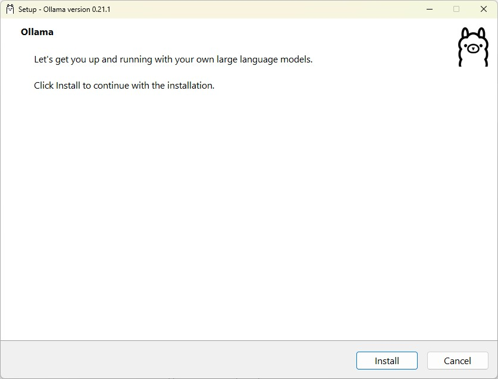
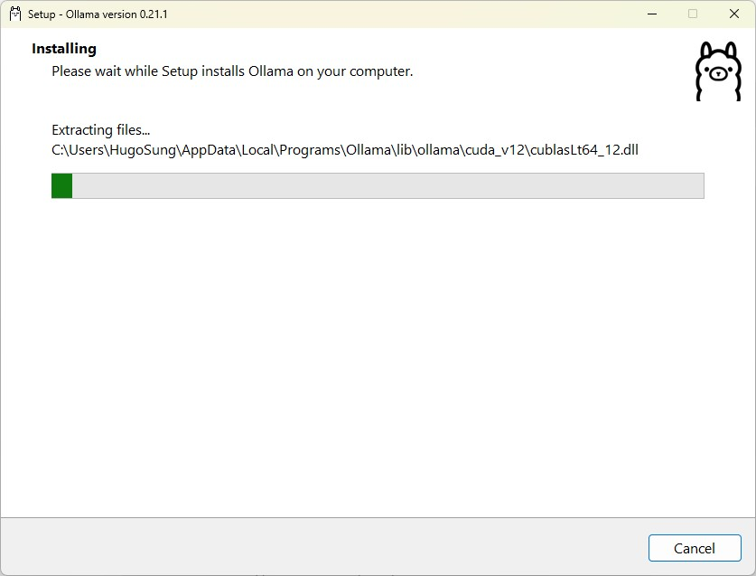
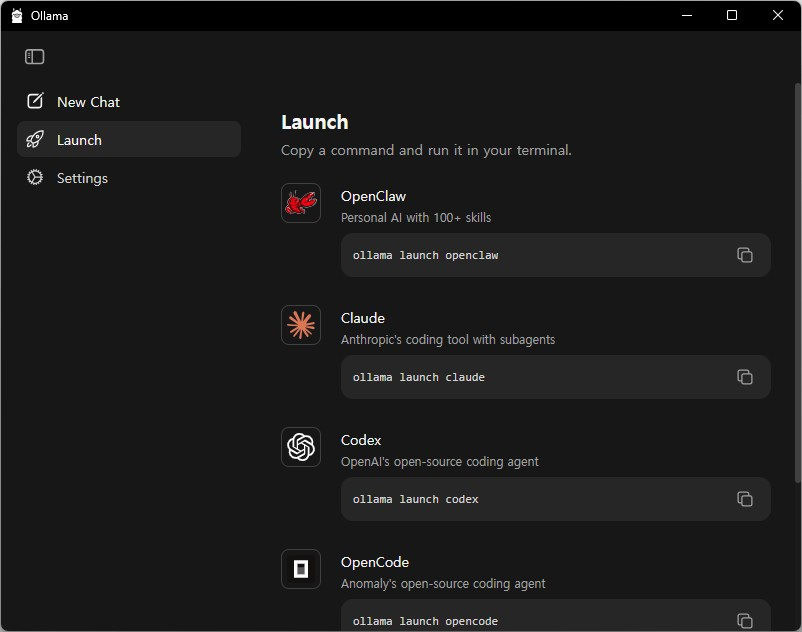

# Ollama 

## 사용법

### 설치

- https://ollama.com/ 웹사이트 진입
- 다운로드 페이지에서 OS플랫폼에 맞춰서 다운로드





### 설치완료



#### 터미널 실행

- 설치 및 버전확인

    ```powershell
    > ollama --version
    ollama version is 0.21.1
    ```

- Codex 설치

    ```powershell
    > ollama launch codex
    Error: codex is not installed, install from https://developers.openai.com/codex/cli/
    ```