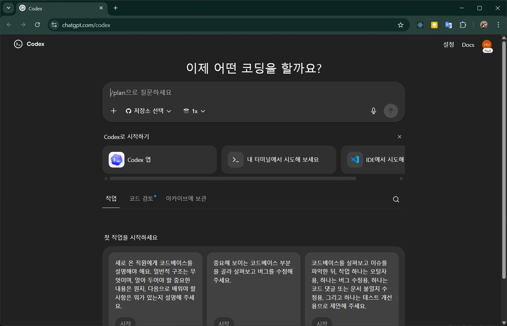
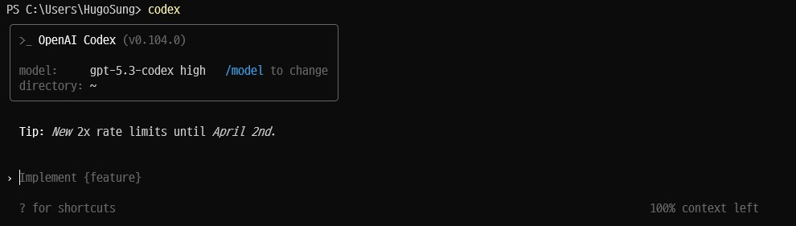
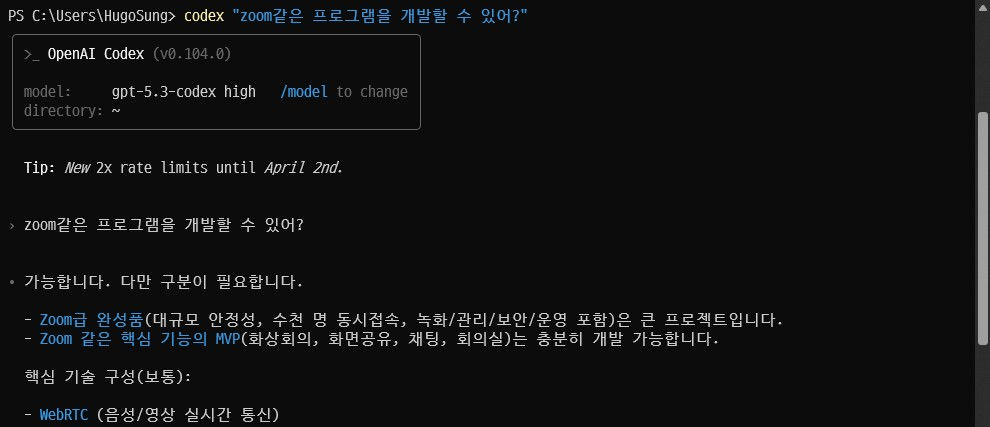
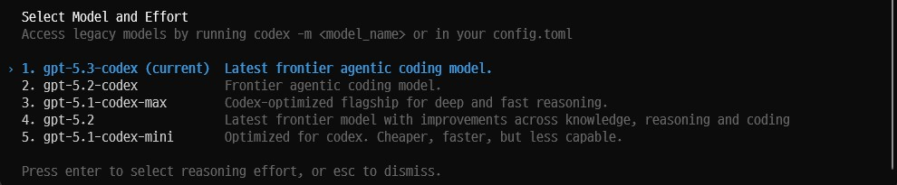
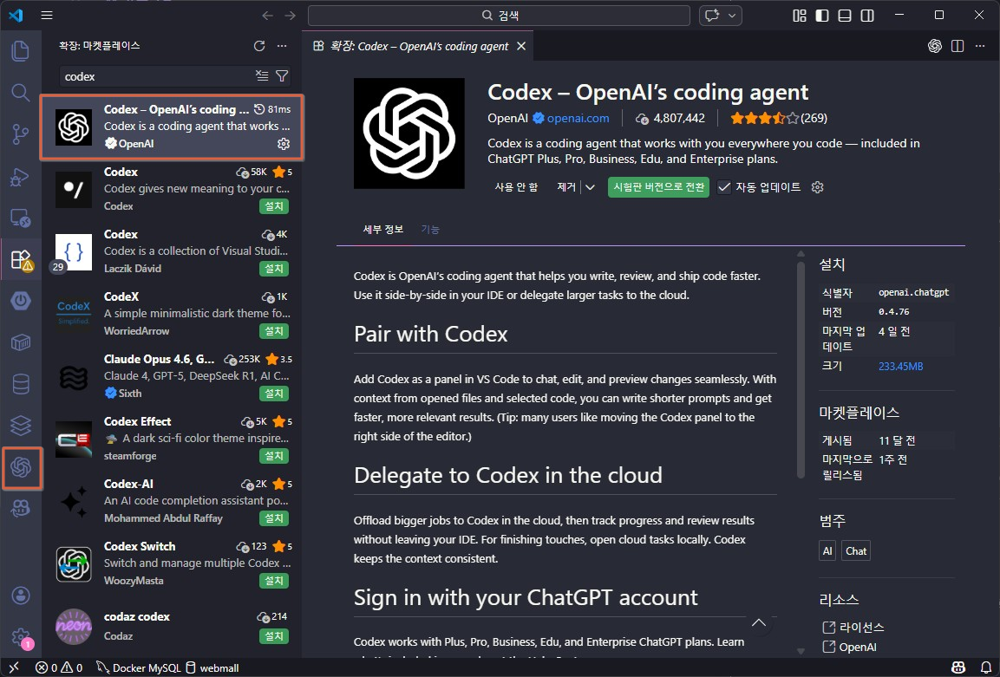
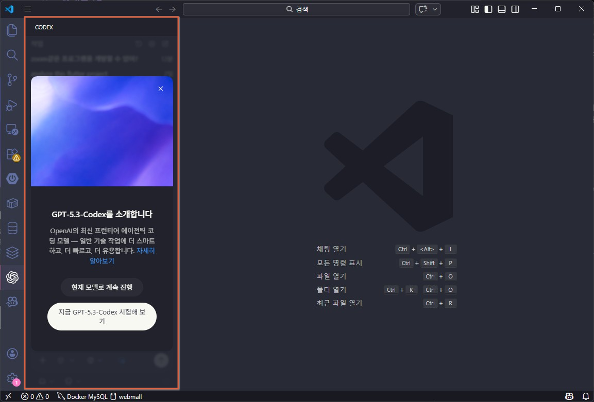
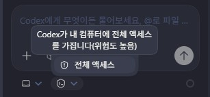
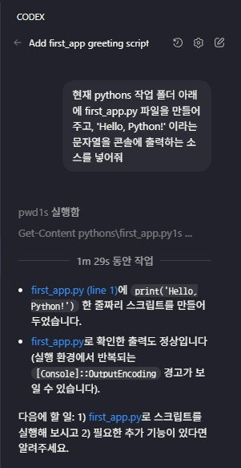
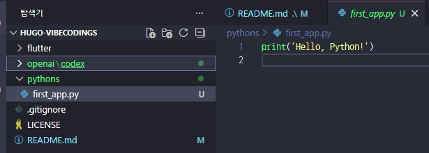

# GPT Codex

## 개요

챗GPT의 OpenAI에서 출시한 에이전트형 모델

- 소개글 : [링크](https://openai.com/ko-KR/index/introducing-the-codex-app/)

### 특징

- Codex CLI, IDE 확장 사용, 클라우드 환경 및 GitHub에서 독립적인 작업 수행
- 작업 복잡도에 따른 적응형 추론 시간 조절 가능
- 실시간 코드 분석, 일관성 있는 구현 가능

### ChatGPT 서브메뉴

- https://chatgpt.com/codex 에서 확인 가능




## 튜토리얼

### 기본 설치

- macOS, Linux, Windows 멀티 플랫폼
- node 사전 설치 필요

    ```python
    # npm으로 설치
    npm install -g @openai/codex

    # 또는
    brew install codex
    ```

### CLI 사용법

1. 명령
    ```python
    codex
    ```
    

2. 프롬프트로 명령 실행
    ```python
    codex "필요한 설명"
    ```

    

3. 모델 전환

    ```python
    /model 
    ```
    

    - Model changed to gpt-5.1-codex-mini medium

### 프롬프트 가이드

- 간결한 프롬프트로 처리할 것
    - 주의깊게, 자세히, 조심스럽게... 등의 문장 요소 불필요
    - 수정해줘, 분석해줘, 최적화해줘 등의 명령으로 완료할 것

### Visual Studio Code Codex

1. VSCode extension 에서 Codex 검색 후 설치

    

2. OpenAI 아이콘 클릭

    

3. CODEX 작업화면
    - 전체 액세스를 설정했을 때 (위험도 높음) 경고
    - 최대한 전체 액세스 하지 말 것

    

4. 이후 로컬 MCP 서버와 동일하게 사용가능

    - 아래의 정말 간단한 요청에 1분 30초 소요

    

    - 결과 화면

    