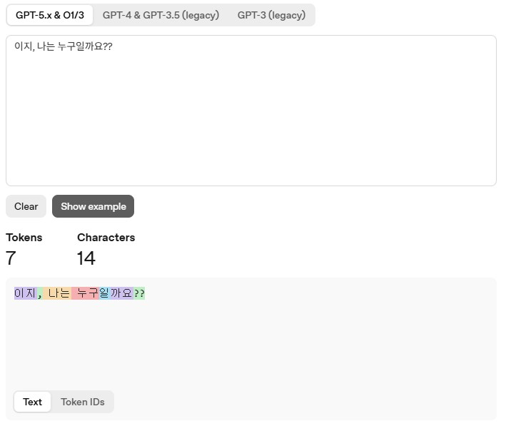

## 바이브 코딩

### 용어정리

#### LLM

- Large Language Model, LLM
    - 대규모 언어 모델
    - 수많은 문장과 자료를 학습, 단어와 문장 사이의 관게를 파악하여
    - 사용자의 질문에 가장 적절한 답변을 생성하는 AI

- 트랜스포머
    - 맥락에 따라 단어의 의미를 조정할 수 있도록 도와주는 기술

- 토큰
    - AI에서 정보를 논리적으로 나눈 단위

    

- 컨텍스트 윈도우
    - AI가 한번에 기억할 수 있는 문맥의 용량

#### LLM 활용법

- 프롬프트 엔지니어링
	- 프롬프트를 효과적으로 작성, 최상의 결과를 얻기위한 방법
	
- 검색 증강 생성
	- RAG(Retrieval Augmented Generation) : 데이터베이스에서 사용자의 질문에 관련된 문서만 검색 결과를 프롬프트에 포함시키는 방법
	- 개인정보 유출 주의 필요
	
- 파인 튜닝
	- 처리하려는 작업에 맞게 설계된 특정 데이터세트로 LLM을 훈련하는 것
	
- 모델 훈련
	- 처음부터 관련된 데이터로만 모델을 훈련하는 방법
	
#### 프롬프트 종류

- 제로샷 프롬프트
	- 아무 예제없이 바로 작업을 AI에게 요청하는 프롬프트

- 원샷 프롬프트
	- 예제 하나를 제공한 후 비슷한 작업을 수행하도록 요청
	
- 퓨샷 프롬프트
	- 2~5개의 예제를 제공한 뒤, 작업 수행을 요청
	
#### 설계

- 지시형 프롬프트
- 응답 형식 지정
- 컨텍스트 제공
	- 관련 배경정보 제공, 관련 도메인 명시, 제약조건이나 한계 설명
- 하네스 엔지니어링
	- 제약 조건, 검증, 피드백 루프를 갖춘 안전장치를 설계하여 안정적인 코드 품질을 보장하는 엔지니어링 방법