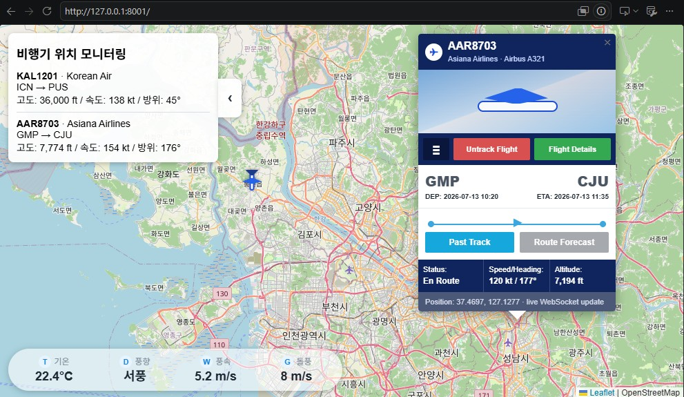

# 비행기 위치 모니터링

FastAPI와 Leaflet으로 만든 데모용 비행기 위치 모니터링 앱입니다.

## 실행

```powershell
cd D:\01_Programming\181_Hugo_Projects\hugo-vibecodings\pythons\plane-tracker
pip install -r requirements.txt
uvicorn main:app --reload
```

브라우저에서 엽니다.

```text
http://127.0.0.1:8000
```

## 기능

- WebSocket 기반 실시간 항공기 위치 갱신
- 진행 방향으로 회전하는 비행기 모양 마커
- 접히는 왼쪽 비행기 모니터링 패널
- 기온, 풍향, 풍속, 돌풍 레이어
- 항공기 상세 카드 팝업

현재 항공기 위치는 실제 API가 아니라 `main.py`의 데모 데이터를 기반으로 생성됩니다.

